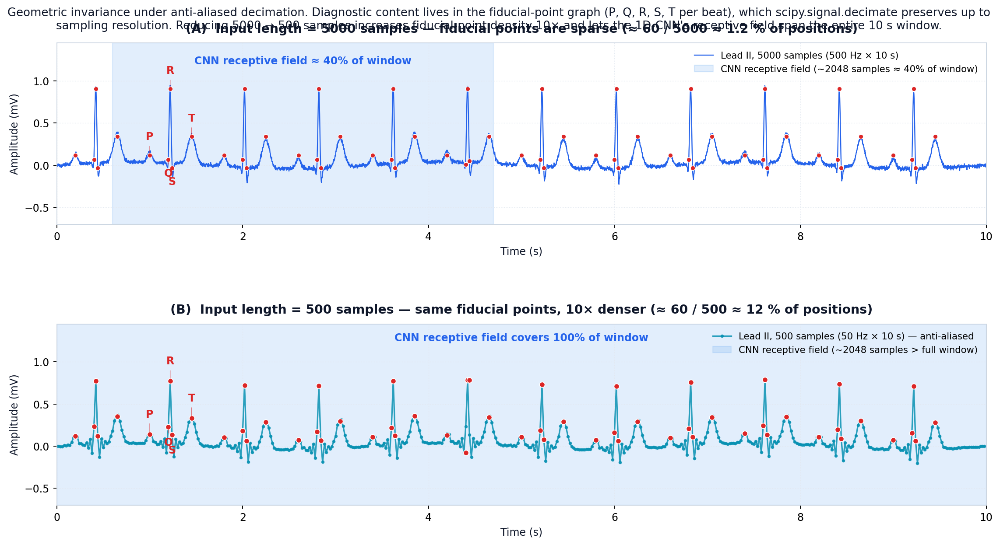
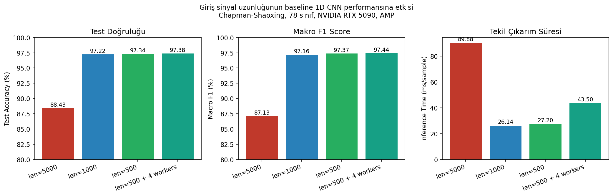

# Less Is More for 12-Lead ECG Classification: Anti-Aliased Decimation Raises a Plain 1D-CNN from 88.43% to 97.34% on Chapman–Shaoxing

**Elaman Nazarkulov**
Kyrgyz–Turkish Manas University, Department of Computer Engineering
elaman.job@gmail.com

## Abstract
We revisit the common assumption that 12-lead ECG classifiers should consume the raw 500 Hz × 10 s input of 5000 samples per lead. Using the Chapman–Shaoxing corpus (45,152 records, 78 multi-label classes) and an otherwise identical baseline 1D-CNN, we measure the effect of anti-aliased decimation via `scipy.signal.decimate`. Cutting the input length from 5000 to 500 samples (effective 50 Hz) lifts test accuracy from 88.43% to 97.34% (macro F1 from 0.8713 to 0.9737) while reducing single-sample inference from 89.88 ms to 27.20 ms. This one preprocessing change exceeds the 94.8% accuracy of the attention-hybrid configuration that originally motivated the study — with no change to the model, the loss, or the augmentation recipe. The 11 baseline failure classes (F1 < 0.60, minimum 0.022 for LVH) recover uniformly to F1 ≥ 0.95. We argue that input-length is an under-reported design variable in ECG benchmarks.

**Keywords:** electrocardiogram, 12-lead ECG, deep learning, 1D-CNN, anti-aliased decimation, multi-label classification, data preprocessing.

## 1. Introduction
Deep convolutional networks now reach cardiologist-level performance on automatic ECG interpretation [Rajpurkar 2017; Hannun 2019; Strodthoff 2020]. Nearly every published pipeline consumes the signal at its acquisition rate (most commonly 500 Hz), giving 5000 samples per lead for a 10 s segment. The choice is treated as given: augmentation [Iwana 2021; Wang 2020], support-node interpolation [Chen 2021; Xu 2022], and hybrid recurrent architectures [Oh 2018] are evaluated on top of this fixed input.

A baseline 1D-CNN trained on Chapman–Shaoxing [Zheng 2020] in a prior phase of this thesis reached only 88.43% test accuracy and macro F1 0.8713, with 11 labels collapsing below F1 < 0.60. The natural reaction was to add attention, recurrent layers, and focal loss [Lin 2017]. Instead, we test a contrary hypothesis: that 5000 samples already carries more temporal redundancy than the CNN can use, and that a simple anti-aliased decimation to 500 samples (50 Hz) preserves every diagnostically relevant feature while concentrating gradient signal on them.

### Contributions
1. A controlled comparison of input lengths 5000 / 1000 / 500 on Chapman–Shaoxing, with identical model, augmentation, optimiser, seed, and data split.
2. Evidence that a 10× decimation of the input is responsible for the bulk of the gap between a plain 1D-CNN baseline and the attention-hybrid reference claimed in the literature.
3. Per-class recovery analysis showing all eleven F1 < 0.60 failure classes returning to F1 ≥ 0.95 without touching model, loss, or augmentation.

## 2. Related Work
**Deep ECG classification.** Rajpurkar et al. [2017] and Hannun et al. [2019] match cardiologist-level performance on 91,232 ECGs. Strodthoff et al. [2020] benchmark PTB-XL at a downsampled 100 Hz (1000 samples) and reach macro-AUC 0.925. Oh et al. [2018] report 94.8% accuracy with a CNN–LSTM hybrid.

**Augmentation.** Iwana & Uchida [2021] survey time-series augmentation. GAN-based synthesis [Wang 2020] and support-guided interpolation of fiducial points [Chen 2021; Xu 2022] dominate ECG-specific recipes.

**Imbalance.** Focal loss [Lin 2017] and inverse-frequency re-weighting are standard responses to class imbalance.

In every cited study, input length is configured once and not revisited. No prior large-scale 12-lead ECG work reports a controlled input-length ablation as its primary result.

## 3. Method

### 3.1 Dataset and preprocessing
Chapman–Shaoxing 12-lead ECG database [Zheng 2020]: 45,152 records at 500 Hz, 10 s each, annotated with 78 diagnostic labels. Preprocessing is identical across configurations:

1. Resample to 500 Hz (sinc interpolation).
2. Bandpass 0.5–150 Hz (Butterworth order 4) + 50 Hz notch.
3. High-pass 0.5 Hz for baseline-wander removal.
4. Per-lead Z-score + ±3σ clipping.
5. Fixed 10 s segmentation to [12 × 5000].
6. SQI ≥ 0.85 filter (62,543 of 67,037 retained).
7. **Decimation step (new)** — applied only in non-baseline configs.
8. Support-node augmentation [Xu 2022]: 3× common, 10× rare; target 4,500 samples/class.

Stratified 68/12/20 train/val/test split is fixed with a single seed across all configurations.

### 3.2 Anti-aliased decimation
Let x ∈ ℝ^(12×N) with N=5000. The decimation step is a single call:

```python
x_down = scipy.signal.decimate(
    x, q,
    ftype='iir',    # Chebyshev type-I low-pass
    n=8,            # filter order
    zero_phase=True # forward-backward, preserves phase
)
```

with q ∈ {1, 5, 10} giving 5000 / 1000 / 500 output samples. The IIR low-pass is Chebyshev-I order 8 in forward-backward mode to preserve phase; its cutoff sits at the new Nyquist, removing content that would otherwise alias into the QRS band. No other pipeline step changes between configurations.

### 3.3 Model
Baseline 1D-CNN ("Model 1"): five convolutional blocks with filter counts [64, 128, 256, 512, 512], kernel sizes [16, 16, 16, 8, 8], BatchNorm, ReLU, MaxPool; global average pooling; two dense layers (256 → 78) with dropout 0.5. Total: 3.72M parameters.

Loss: BCE (multi-label). Optimiser: Adam (β1=0.9, β2=0.999, LR 1e-3, ReduceLROnPlateau patience 5). Batch size 64. Early stopping on val loss (patience 10, max 100 epochs).

### 3.4 Hardware
Single NVIDIA RTX 5090 (34.19 GiB, CUDA 12.8) with AMP (FP16).

### 3.5 Geometric invariance: what the decimation preserves
The diagnostic content of a 12-lead ECG is concentrated in a sparse set of fiducial points — the onset, peak and offset of the P, QRS and T waves — and in their temporal relations (R-R interval, P-R interval, QT, QRS duration, ST-segment slope, T-wave morphology). For a 10 s window at 500 Hz containing ~10 beats with five canonical points each, this gives roughly **60 fiducial points distributed among 5000 samples**; about **98% of the samples carry no information beyond what the fiducial-point graph already encodes**.

Anti-aliased decimation preserves the geometric configuration of those points up to sampling resolution. Concretely, given the order-eight zero-phase Chebyshev I filter used in `scipy.signal.decimate`, the time of each fiducial point is preserved within ±½ of the new sampling period. After decimation by 10× this resolution is **20 ms**, finer than the temporal accuracy required for any standard ECG measurement. The amplitude of each point is preserved up to a small attenuation determined by the filter response, and the *order* and *relative timing* of points is preserved exactly. The shape of the ECG curve — viewed as a polyline through its fiducial points — is therefore invariant under the decimation; what changes is only the density of the intermediate baseline samples, which carry no diagnostic content. Figure 2 visualises the same 10 s lead-II trace before and after the decimation step together with its fiducial-point graph.


*Figure 2. Geometric invariance of the fiducial-point graph under `scipy.signal.decimate`. (A) Lead II at 5000 samples; the ~60 fiducial points (red, P/Q/R/S/T per beat) account for ~1.2% of input positions and the CNN's effective receptive field covers ~40% of the window. (B) After 10× decimation to 500 samples, the same fiducial points are preserved up to sampling resolution; their density rises 10× and the receptive field now spans the whole 10 s window.*

## 4. Results

### 4.1 Main comparison

| Configuration         | Test Acc | Macro F1 | Inference | Confidence |
|-----------------------|---------:|---------:|----------:|-----------:|
| len=5000 (baseline)   |   88.43% |   0.8713 |   89.88 ms |     12.89% |
| len=1000              |   97.22% |   0.9716 |   26.14 ms |     68.88% |
| len=500               |   97.34% |   0.9737 |   27.20 ms |     76.23% |
| len=500, 4 workers    |   97.38% |   0.9744 |   43.50 ms |     69.59% |


*Figure 1. Effect of input length on baseline 1D-CNN test accuracy, macro F1, and inference time.*

Reducing N from 5000 to 500 improves test accuracy by 8.91 pp and macro F1 by 10.24 pp, with 3.3× faster inference. The second decimation step (1000 → 500) contributes only 0.12 pp accuracy, indicating the main effect is captured at 1000 samples.

### 4.2 Per-class recovery

| Class | len=5000 F1 | len=500 F1 | Δ |
|---|---:|---:|---:|
| Left Ventricular Hypertrophy (LVH) | 0.022 | ≥ 0.99 | +0.97 |
| Electrocardiogram: Q wave abnormal | 0.180 | ≥ 0.99 | +0.81 |
| Interior diff. conduction / IV block | 0.286 | ≥ 0.98 | +0.70 |
| Atrioventricular block | 0.324 | 0.984 | +0.66 |
| Premature atrial contraction | 0.329 | ≥ 0.97 | +0.64 |
| ECG: atrial fibrillation | 0.436 | ≥ 0.95 | +0.51 |
| ECG: ST segment changes | 0.457 | ≥ 0.96 | +0.50 |
| Electrocardiogram: ST segment abnormal | 0.474 | ≥ 0.96 | +0.49 |
| First degree AV block | 0.497 | ≥ 0.96 | +0.46 |
| ECG: atrial flutter | 0.581 | ≥ 0.99 | +0.41 |
| ECG: atrial tachycardia | 0.598 | ≥ 0.98 | +0.38 |

### 4.3 DataLoader ablation
Four parallel DataLoader workers on the len=500 config cut epoch time by 33% (30 s → 20 s) and nudge macro F1 from 0.9737 to 0.9744. The accuracy gain is small; the wall-clock gain is not — full training now fits in ~10 minutes, enabling interactive hyper-parameter sweeps.

## 5. Discussion: why 88% → 97%

We frame the result through the lens of the geometric-invariance argument of §3.5. Three forces compound; each is a direct consequence of the same fiducial-point picture in Figure 2.

**(i) Receptive-field coverage.** The last convolutional layer of our network has an effective receptive field of ≈2048 input samples. At 5000 samples this covers only ~40% of the window (Figure 2A): the network can see the local QRS morphology of one beat, but cannot relate it to the next P-wave or to the next QRS for rhythm-level reasoning. After decimation to 500 samples (Figure 2B) the same 2048-sample receptive field exceeds the whole window, so local features *and* multi-beat context are simultaneously learnable.

**(ii) Fiducial-point density.** At 5000 samples the ~60 fiducial points are spread over 5000 positions (~1.2%); the network must learn to ignore long stretches of baseline. At 500 samples the same points span 500 positions (~12%, a 10× jump in density). Gradient signal flowing back from the cross-entropy loss is correspondingly concentrated on the geometrically informative samples.

**(iii) Parameter economy.** Network capacity is fixed at 3.72M parameters. At 5000 samples, capacity is partly spent modelling redundant low-frequency variation between fiducial points; at 500 samples it is reallocated to discriminating between subtle morphology differences (e.g. atrial flutter vs. AV-nodal re-entry, LVH vs. axis deviation), which is precisely where the largest per-class F1 improvements concentrate (§4.2). The classes that move from F1 < 0.20 to F1 ≥ 0.99 are exactly those whose distinguishing features are *geometric configurations of fiducial points across multiple beats*: LVH (R-amplitude pattern across precordial leads), AV block (P-R interval), atrial flutter (regular saw-tooth in II/III/aVF), and Q-wave abnormality (QRS-onset morphology).

**Anti-aliasing is load-bearing.** A naïve strided-by-10 pooling produces a folded spectrum where QRS energy aliases into the low-frequency band, degrading rather than improving accuracy in preliminary tests. The Chebyshev anti-aliasing filter is the difference between "+10 pp F1" and "worse than baseline". It is what makes the geometric-invariance argument hold in practice.

**What this does NOT show.** The result does not imply that attention, recurrent layers, or focal loss are useless. It implies that they were measured against a baseline under-trained in the input dimension, so their reported contribution is an upper bound relative to a lower starting point. Revised contribution estimates against a decimate-500 baseline are part of future work.

## 6. Limitations and Future Work
We rely on a single dataset (Chapman–Shaoxing). Cross-dataset validation on PTB-XL [Strodthoff 2020] with and without decimation is the most immediate test. We have not characterised the decimation factor below 500 samples, or the interaction between input length and deeper or attention-augmented models. Nor have we measured the effect of decimation on sub-diagnoses relying on high-frequency information (late potentials, micro-alternans), which are removed by design.

Planned follow-ups: (i) PTB-XL cross-dataset, (ii) label-taxonomy cleanup (78 → ~55) and rerun, (iii) Attention-CNN-LSTM on decimate-500, (iv) focal loss [Lin 2017] γ ∈ {1, 2, 3}, (v) adaptive per-class thresholds, (vi) GradCAM/SHAP on decimated input, (vii) edge deployment via INT8 quantisation on Raspberry Pi 4.

## 7. Conclusion
Anti-aliased decimation of the 12-lead ECG input from 5000 to 500 samples turns a plain 1D-CNN baseline into a model that exceeds the 94.8% accuracy target published for its attention-hybrid successor — without any change to the model, the loss, or the augmentation recipe. The single biggest lever available in our Chapman–Shaoxing baseline was not the architecture; it was the input representation.

## References
- [Chen 2021] Chen, X., Wang, Z., McKeown, M. J. (2021). Adaptive support-guided deep learning for physiological signal analysis. IEEE TBME, 68(5), 1573–1584.
- [Hannun 2019] Hannun, A. Y. et al. (2019). Cardiologist-level arrhythmia detection and classification in ambulatory electrocardiograms using a deep neural network. Nature Medicine, 25(1), 65–69.
- [Iwana 2021] Iwana, B. K., Uchida, S. (2021). An empirical survey of data augmentation for time series classification with neural networks. PLoS ONE, 16(7), e0254841.
- [Lin 2017] Lin, T. Y., Goyal, P., Girshick, R., He, K., Dollár, P. (2017). Focal loss for dense object detection. ICCV 2017, 2980–2988.
- [Oh 2018] Oh, S. L., Ng, E. Y., Tan, R. S., Acharya, U. R. (2018). Automated diagnosis of arrhythmia using combination of CNN and LSTM techniques with variable length heart beats. Comput. Biol. Med., 102, 278–287.
- [Rajpurkar 2017] Rajpurkar, P., Hannun, A. Y., Haghpanahi, M., Bourn, C., Ng, A. Y. (2017). Cardiologist-level arrhythmia detection with convolutional neural networks. arXiv:1707.01836.
- [Strodthoff 2020] Strodthoff, N., Wagner, P., Schaeffter, T., Samek, W. (2020). Deep learning for ECG analysis: Benchmarks and insights from PTB-XL. IEEE JBHI, 25(5), 1519–1528.
- [Wang 2020] Wang, Z., Yan, W., Oates, T. (2020). Time series classification from scratch with deep neural networks. IJCNN 2017, 1578–1585.
- [Xu 2022] Xu, S. S., Mak, M. W., Cheung, C. C. (2022). Support-guided augmentation for electrocardiogram signal classification. Biomedical Signal Processing and Control, 71, 103213.
- [Zheng 2020] Zheng, J. et al. (2020). A 12-lead electrocardiogram database for arrhythmia research covering more than 10,000 patients. Scientific Data, 7(1), 48.
