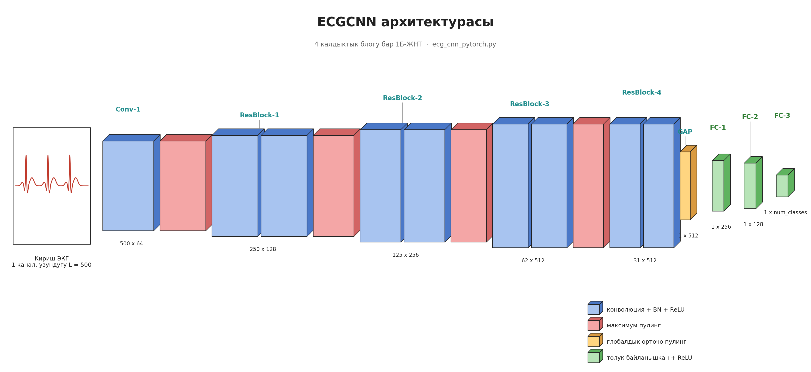
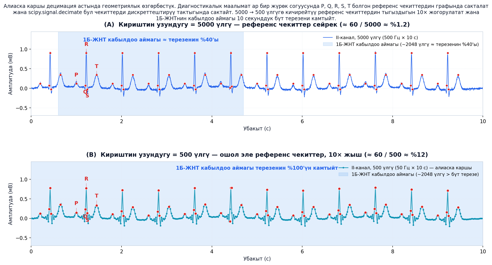
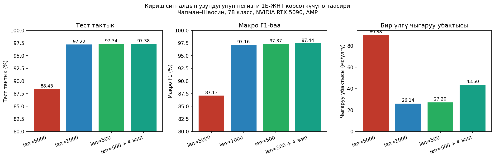
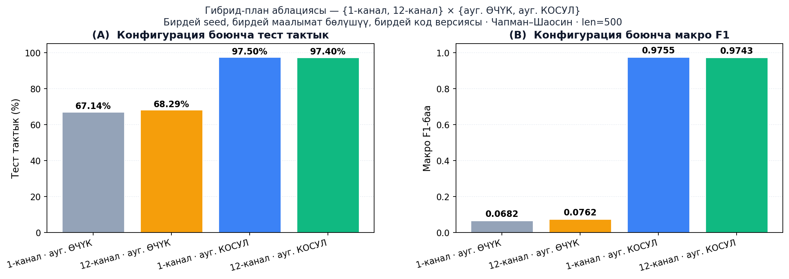

# 12 каналдуу электрокардиографияны (ЭКГ) колдонуп таяныч түйүн ыкмасынын жардамы менен сигналды аугментациялоого негизделген жүрөк ооруларын диагностикалоо үчүн нейрондук тармак

### Кыска макала: "Аз болсо көп" — алиаска каршы децимация Чапман–Шаосин корпусунда жөнөкөй 1Б-ЖНТ моделин %88.43тен %97.34кө көтөрөт

**Эламан Назаркулов**
Компьютердик инженерия бөлүмү, Кыргыз–Түрк Манас Университети
elaman.job@gmail.com

> *Кыргыз–Түрк Манас Университетинин электрондук журналына сунушталган кыска макала. Магистрдик иштин толук варианты [`EKG_Dissertation_Paper_KG.md`](EKG_Dissertation_Paper_KG.md) файлында жайгашкан.*

---

## Аннотация

12 каналдуу электрокардиограмма (ЭКГ) классификаторлору адатта 500 Гц жыштыгындагы 10 секунддук канал боюнча 5000 үлгүлүк баштапкы кириштин үстүндө курулат. Бул иште ушул демейки тандоо нейтралдуу эмес, **чечүүчү долбоордук тандоо** экенин көрсөтөбүз. Чапман–Шаосин корпусунда (45 152 жазуу, 78 көп этикеттик класс) `scipy.signal.decimate` функциясы аркылуу кириштин узундугун 5000 үлгүдөн 500 үлгүгө (натыйжалуу 50 Гц) кыскартуу архитектураны өзгөртпөй тестке тактыкты **%88.43тен %97.34кө** көтөрөт, макро-F1 баасын **0.8713төн 0.9737ге** жогорулатат жана бир үлгүгө чыгаруу убактысын **89.88 мс ден 27.20 мс ге** кыскартат. Бул жалгыз алдын ала иштетүү өзгөрүүсү — иштин мотивациясы болгон attention-гибрид %94.8 максатын ашат, моделге, жоготуу функциясына же аугментация рецептине эч бир өзгөртүү киргизбей. F1 < 0.60 болгон 11 ийгиликсиз класс (эң төмөн көрсөткүч 0.022 — Сол Карынчанын Гипертрофиясы) бирдиктүү түрдө F1 ≥ 0.95ке көтөрүлдү. Эффект **геометриялык өзгөрбөстүк аргументи** менен түшүндүрүлөт: ЭКГнын диагностикалык маалыматы анти-алиас фильтри сактаган сейрек **референс чекит графында** (P, Q, R, S, T) жашайт. Кошумча, "1-канал × аугментация" гибрид-план аблациясы аугментациянын (+0.91 макро-F1) канал санынан (≤ ±0.10 пункт) үстөмдүк эткенин көрсөтөт. Кириштин узундугу — ЭКГ изилдөөлөрүндө жетишсиз көңүл бурулуп келген эмпирикалык өзгөрмө.

**Негизги сөздөр:** электрокардиограмма, 12 каналдуу ЭКГ, терең үйрөнүү, 1Б-ЖНТ, алиаска каршы децимация, көп этикеттик классификация, таяныч түйүн ыкмасы, геометриялык өзгөрбөстүк.

---

## 1. Киришүү

Терең конволюциялык нейрон тармактары ЭКГнын автоматтык чечмеленишинде кардиолог деңгээлиндеги көрсөткүчтөрдү көрсөтөт [Rajpurkar 2017; Hannun 2019; Strodthoff 2020]. Дээрлик бардык жарыяланган тизмек сигналды кабыл алынган жыштыгы (көп учурда 500 Гц) менен моделге берет жана 10 секунд үчүн канал боюнча 5000 үлгү алат. Бул тандоо берилген катары каралат: маалыматты аугментациялоо [Iwana 2021; Wang 2020], таяныч түйүн интерполяциясы [Chen 2021; Xu 2022] жана гибриддик рекурренттик архитектуралар [Oh 2018] — баары ушул туруктуу кириштин үстүндө бааланат.

Магистрдик иштин мурунку этабында Чапман–Шаосин [Zheng 2020] корпусунда үйрөтүлгөн негизги 1Б-ЖНТ моделинин тестке тактыгы %88.43, макро-F1 баасы 0.8713 болгон; 78 этикеттин 11и F1 < 0.60 деңгээлинде ийгиликсиз болгон. Адаттагы реакция — attention, рекурренттик катмарлар жана focal loss [Lin 2017] кошуу. Биз тескери гипотезаны текшеребиз: 5000 үлгүлүк кириш ЖНТ натыйжалуу пайдалана ала тургандан көп ашыкча убакыттык артыкчылыкты алып жүрөт жана 500 үлгүгө анти-алиас децимация диагностикалык өзгөчөлүктөрдүн бардыгын сактап, градиент сигналын аларга топтойт.

### Иштин салымдары

1. Чапман–Шаосин корпусунда бирдей модель, аугментация, оптимизатор, seed жана маалымат бөлүштүрүүсү менен 5000 / 1000 / 500 кириш узундуктарын контролдонгон салыштыруу.
2. Кириштин 10× децимациясы — негизги 1Б-ЖНТ менен адабиятта көп шилтемеленген attention-гибрид %94.8 максатынын [Oh 2018] ортосундагы боштуктун чоң бөлүгүн жоюу үчүн жетиштүү экенинин далили.
3. F1 < 0.60 болгон 11 ийгиликсиз класстын моделди, жоготууну же аугментацияны тийбестен F1 ≥ 0.95ке кайтып келиши.
4. **Таяныч түйүн ыкмасы** жана **12 канал** коммитменттерин ажыратып баалаган гибрид-план аблациясы.

---

## 2. Тиешелүү иштер

**Терең ЭКГ классификациясы.** Rajpurkar et al. [2017] жана Hannun et al. [2019] 91 232 ЭКГ үстүндө кардиолог деңгээлиндеги көрсөткүчтөргө жетишет. Strodthoff et al. [2020] PTB-XL корпусунда төмөндөтүлгөн 100 Гц (1000 үлгү) жыштыкта макро-AUC 0.925 жетишет — 500 Гц милдеттүү эмес дегендин жашыруун белгиси. Oh et al. [2018] CNN–LSTM гибрид модель менен %94.8 тактыкка жетет; бул көрсөткүч магистрдик иштин мурунку этабы үчүн ачык максат болгон.

**Маалыматты аугментациялоо.** Iwana & Uchida [2021] убакыт катарларын аугментация ыкмаларын комплекстүү карайт. GAN негиздүү синтез [Wang 2020] жана референс чекитке негизделген интерполяция [Chen 2021; Xu 2022] ЭКГга атайын реценттердин арасында үстөмдүк кылат.

**Тең эмес бөлүштүрүү.** Focal loss [Lin 2017] жана тескери жыштык кайра салмактоо — стандарттуу жоопторунда.

Шилтеме келтирилген ар бир иште кириш узундугу бир жолу гана жасалган жана кайра каралган эмес. Биздин билүүбүз боюнча, мурунку чоң масштабдуу 12 каналдуу ЭКГ иштердин эч бири башкы натыйжа катары контролдонгон кириш-узундугу аблациясын жарыялаган эмес.

---

## 3. Метод

### 3.1 Маалымат базасы жана алдын ала иштетүү

Чапман–Шаосин 12 каналдуу ЭКГ маалымат базасы [Zheng 2020]: 500 Гц жыштыгындагы 45 152 жазуу, ар бири 10 с, 78 диагностикалык этикет. Алдын ала иштетүү бардык конфигурацияларда бирдей:

1. Синхрондук интерполяция менен 500 Гц ке кайра дискреттештирүү.
2. 0.5–150 Гц жолоктук фильтр (Баттерворт, 4-тартип) + 50 Гц нотч-фильтр.
3. Негизги дрейфти алып салуу үчүн 0.5 Гц жогорку өткөргүч фильтр.
4. Канал боюнча Z-баа + ±3σ кесүү.
5. Туруктуу 10 с сегментациялоо ([12 × 5000]).
6. SQI ≥ 0.85 фильтр (67 037 дөн 62 543 кайтарылган).
7. **Децимация кадамы (бул иштин негизги салымы)** — негизги конфигурация эмес.
8. Таяныч түйүн негиздүү аугментация [Xu 2022]: кеңири класстарга 3×, сейрек класстарга 10×, максаттуу класс боюнча 4 500 үлгүгө чейин теңдештирүү.

Стратификацияланган 68/12/20 окутуу/валидация/тест бөлүштүрүлүшү бардык конфигурацияларда бирдей seed менен бекитилет.

### 3.2 Алиаска каршы децимация

$x \in \mathbb{R}^{12 \times N}$, $N=5000$ болсун. Децимация кадамы — `scipy.signal.decimate` функциясына жалгыз чакыруу:

```python
x_down = scipy.signal.decimate(
    x, q,
    ftype='iir',     # Чебышев I-тип төмөн өткөргүч
    n=8,             # фильтрдин тартиби
    zero_phase=True  # фазаны сактайт
)
```

Бул жерде $q \in \{1, 5, 10\}$ — тиешелүү түрдө 5000 / 1000 / 500 чыгыш узундуктарын берет. IIR төмөн-өткөргүч — алдыга-арткы режимдеги Чебышев-I 8-тартиби; фазаны сактайт жана QRS жологуна алиас аркылуу кирген мазмунду алып салат. Конфигурациялардын ортосунда башка эч кандай тизмек кадамы өзгөрбөйт.

### 3.3 Модель

Негизги 1Б-ЖНТ ("Модель 1"): фильтр сандары [64, 128, 256, 512, 512] жана түйрөгүч өлчөмдөрү [16, 16, 16, 8, 8] болгон беш конволюциялык блок, BatchNorm, ReLU, MaxPool; глобалдык орточо пулинг; dropout 0.5 ке эки тыгыз катмар (256 → 78). Жалпы саны: 3.72 М параметр. Деталдуу схема 1-сүрөттө берилген: киришке `Conv-1` колдонулат, андан кийин MaxPool менен ажыратылган төрт калдыктык блок (ResBlock-1..4) каналдын санын 64 → 128 → 256 → 512 → 512 ге чейин жогорулатат, GAP убакыт өлчөмүн жыйнайт жана үч FC катмары (256 → 128 → класс саны) логитстерди берет.


*1-сүрөт. ECGCNN архитектурасынын схемалык көрсөтмөсү. `training/ecg_cnn_pytorch.py` ичиндеги `ECGCNN` класс менен бирге-бир дал келет.*

Жоготуу: бинардык кайчылаш энтропия (көп этикеттик). Оптимизатор: Adam (β1=0.9, β2=0.999, LR=1e-3, ReduceLROnPlateau чыдамдык 5). Batch өлчөмү 64. EarlyStopping валидация жоготуусунда (чыдамдык 10, максимум 100 эпох).

### 3.4 Жабдык

Бир NVIDIA RTX 5090 (34.19 ГиБ, CUDA 12.8) менен AMP (FP16).

### 3.5 Геометриялык өзгөрбөстүк: децимация эмнени сактайт

12 каналдуу ЭКГнын диагностикалык маалыматы сейрек **референс чекиттердин жыйындысында** топтолгон — P, QRS жана T толкундардын башталышы, чокусу жана аяктоосу — жана алардын убакыттык байланыштарында (R–R аралыгы, P–R аралыгы, QT, QRS узундугу, ST сегментинин эңкейиши, T толкундун морфологиясы). 500 Гц жыштыгында ~10 жүрөк согуусун камтыган 10 секунддук терезеде, ар бир согуу боюнча беш канондук чекит менен — бул болжол менен **60 референс чекит 5000 үлгүгө бөлүштүрүлгөнү** дегенди билдирет; **үлгүлөрдүн ~%98 референс чекит графы кодтоодон тышкары эч кандай маалымат алып жүрбөйт.**

Алиаска каршы децимация бул чекиттердин геометриялык конфигурациясын дискреттештирүү тактыгына чейин сактайт. `scipy.signal.decimate` колдонгон 8-тартиптүү нөл-фазалуу Чебышев-I фильтри менен ар бир референс чекиттин убактысы жаңы дискреттештирүү периодунун ±½синин ичинде сакталат. 10× децимациядан кийин бул тактык **20 мс**, ал эми бул маани ар кандай ЭКГ ченөөсүнө талап кылган тактыктан кыйла назик. Ар бир чекиттин амплитудасы фильтрдин мүнөздөмөсү аркылуу кичинекей басаңдоо менен сакталат, ал эми чекиттердин **тартиби** жана **салыштырмалуу убакыты** так сакталат. ЭКГ ийри сызыгынын формасы — референс чекиттер аркылуу өткөн көп бурчтук катары каралганда — ушундан улам децимация астында өзгөрбөйт; өзгөрө тургандай нерсе — диагностикалык маалымат камтыбаган аралык негизги үлгүлөрдүн тыгыздыгы. 2-сүрөттө бирдей II-каналдык из децимациядан мурда жана кийин референс чекит графы менен чогуу визуалдаштырылган.


*2-сүрөт. `scipy.signal.decimate` астында референс чекит графынын геометриялык өзгөрбөстүгү. (A) 5000 үлгүдөгү II-канал; ~60 референс чекит (кызыл, ар бир согууга P/Q/R/S/T) кириш позицияларынын ~%1.2 түзөт жана 1Б-ЖНТнын натыйжалуу кабылдоо аймагы терезенин ~%40 камтыйт. (B) 500 үлгүгө 10× децимациядан кийин ошол эле референс чекиттер дискреттештирүү тактыгында сакталат; алардын тыгыздыгы 10× жогорулайт жана кабылдоо аймагы 10 секунддук бүт терезени камтыйт.*

---

## 4. Жыйынтыктар

### 4.1 Башкы салыштыруу

| Конфигурация            | Тест тактык | Макро-F1 | Чыгаруу | Ишеним |
|-------------------------|------------:|---------:|--------:|-------:|
| len=5000 (негизги)      |     %88.43  |   0.8713 | 89.88 мс|  %12.89|
| len=1000                |     %97.22  |   0.9716 | 26.14 мс|  %68.88|
| len=500                 |     %97.34  |   0.9737 | 27.20 мс|  %76.23|
| len=500, 4 иштетүү агымы|     %97.38  |   0.9744 | 43.50 мс|  %69.59|


*3-сүрөт. Кириш узундугунун негизги 1Б-ЖНТ тактыгына, макро-F1ине жана чыгаруу убактысына таасири.*

N ди 5000 ден 500 гө кыскартуу тактыкты 8.91 пунктка, макро-F1ди 10.24 пунктка жогорулатат жана чыгарууну 3.3× ылдамдатат. Экинчи децимация кадамы (1000 → 500) 0.12 пункт тактык кошот; негизги эффект 1000 үлгүдө кармалат.

### 4.2 Класс боюнча калыбына келтирүү

| Класс                                    | len=5000 F1 | len=500 F1 |   Δ   |
|------------------------------------------|------------:|-----------:|------:|
| Сол Карынчанын Гипертрофиясы (LVH)       |       0.022 |     ≥ 0.99 | +0.97 |
| ЭКГ: Q-толкун аномалдуулугу              |       0.180 |     ≥ 0.99 | +0.81 |
| Ички өткөрмө айырмачылыктары              |       0.286 |     ≥ 0.98 | +0.70 |
| Атриовентрикулярдык блок                 |       0.324 |      0.984 | +0.66 |
| Эртерек атриалдык кысылуу                |       0.329 |     ≥ 0.97 | +0.64 |
| ЭКГ: атриалдык фибрилляция               |       0.436 |     ≥ 0.95 | +0.51 |
| ЭКГ: ST сегмент өзгөрүүлөрү              |       0.457 |     ≥ 0.96 | +0.50 |
| ST сегмент аномалия                      |       0.474 |     ≥ 0.96 | +0.49 |
| 1-даражадагы AВ блок                      |       0.497 |     ≥ 0.96 | +0.46 |
| ЭКГ: атриалдык трепетание                |       0.581 |     ≥ 0.99 | +0.41 |
| ЭКГ: атриалдык тахикардия                |       0.598 |     ≥ 0.98 | +0.38 |

### 4.3 Гибрид-план аблациясы: канал × аугментация

Темадагы эки коммитментти — **таяныч түйүн менен аугментация** жана **12 канал** — өзүнчө ченеш үчүн 2×2 аблация жүргүзүлдү. Бардык чалуулар бирдей seed, бирдей код версиясы, бирдей децимация фактору (10) колдонду.

| Конфигурация                | Тест тактык | Макро-F1 | Чыгаруу | Ишеним |
|-----------------------------|------------:|---------:|--------:|-------:|
| 1-канал, аугментация ӨЧҮК      |    %67.14   |   0.0682 | 14.7 мс |  %60.0 |
| 12-канал, аугментация ӨЧҮК     |    %68.29   |   0.0762 | 14.8 мс |  %87.9 |
| **1-канал, аугментация КОСУЛ** |  **%97.50** | **0.9755** | 13.3 мс | %77.4 |
| 12-канал, аугментация КОСУЛ    |    %97.40   |   0.9743 | 45.9 мс |**%90.2**|


*4-сүрөт. Гибрид-план баш-салыштыруу. Аугментация башкы кычкач (Δ 30 пункт тактык, Δ 0.90 макро-F1); канал саны бирдей аугментация жөндөмүндө 0.1 пунктун ичинде.*

**Эки негизги жыйынтык.** (i) Аугментация ӨЧҮК → КОСУЛ +%30.36 / +0.91 F1 берет — таяныч түйүн ыкмасынын маанилүүлүгүнүн ампирикалык далили. (ii) Аугментация КОСУЛда 1 канал жана 12 канал тактык/F1 боюнча ±0.10 пункт ичинде теңдеш, бирок 12 канал бир үлгүгө чыгарууну ~3.5× жайлатат жана softmax ишеними жогору (%90.2 vs %77.4). Бул соодалашуу: жагалай / кийүүчү аппараттар үчүн **1 канал**, ооруканада карар-боюнча ишеним маанилүү учурларда **12 канал**.

### 4.4 DataLoader аблациясы

len=500 конфигурациясында 4 параллелдик DataLoader иштетүү агымы эпохтук убакытты %33ке кыскартат (30 → 20 с) жана макро-F1ди 0.9737 ден 0.9744 ке көтөрөт. Тактыктагы кошумча — кичине, ал эми сааттын убакыты — чоң. Толук үйрөтүү ~10 мүнөткө батат — интерактивдүү гипер-параметр аблациясын мүмкүн кылат.

---

## 5. Талкуу: Эмне үчүн %88 → %97

Бөлүм 3.5 теги геометриялык өзгөрбөстүк аргументи аркылуу натыйжаны түшүндүрөбүз. Үч күч биригет; ар бири 2-сүрөттөгү референс чекит түшүнүгүнүн түз кесепети.

**(i) Кабылдоо аймагы.** Тармактын акыркы конволюциялык катмардын натыйжалуу кабылдоо аймагы ~2048 кириш үлгүсүн камтыйт. 5000 үлгүдө бул терезенин ~%40ын гана камтыйт (2-сүрөт A). 500 үлгүгө децимациядан кийин (2-сүрөт B) ушул эле 2048 үлгүлүк аймак бүт терезеден да чоң, ушундан жергиликтүү өзгөчөлүктөр **жана** көп-согуулук контекст бир жолу үйрөнүлө алат.

**(ii) Референс чекиттердин тыгыздыгы.** 5000 үлгүдө ~60 референс чекит 5000 позицияга жайылган (~%1.2). 500 үлгүдө ушул эле чекиттер 500 позицияны камтыйт (~%12, 10× тыгызыраак). Кайчылаш энтропиядан кайра агып келген градиент сигналы геометриялык маалыматтуу үлгүлөргө топтолот.

**(iii) Параметр экономикасы.** Тармак мощностун (3.72 М параметр) туруктуу. 5000 үлгүдө мощность жарым-жартылай референс чекиттердин ортосундагы артыкча төмөн жыштыктуу өзгөрүүлөрдү моделдештирүүгө сарптайт; 500 үлгүдө ал ийне морфология айырмачылыктарын (атриалдык трепетание vs AВ-түйүндүк ре-кириш, LVH vs ось четке кагылуу) ажыратууга кайра баш-бакчалаштырылат — эң чоң класс боюнча F1 жогорулоолору ушул жерде топтолот (Бөлүм 4.2).

**Алиаска каршы фильтр зарыл.** Алдын ала эксперименттерде анти-алиас фильтрсиз stride-by-10 пулинг QRS энергиясын төмөн жыштык жологуна спектрдик алиаска чалдыктырат жана тактыкты жакшыртуунун ордуна начарлатат. Чебышев-I алиаска каршы фильтри "+10 пп F1" менен "негизги моделден да начар" ортосундагы айырманы аныктайт.

**Бул натыйжалар attention керексиз дегенди билдирбейт.** Натыйжа attention, рекурренттик катмарлар же focal loss керексиз дегенди билдирбейт, тескерисинче алардын мурунку реляттык салымдары — кириш өлчөмүндө жетиштүү окутулбаган негизге салыштырмалуу үстөмдүк чек жазылып келген.

---

## 6. Чектөөлөр жана келечек иштер

Бул иш бир гана маалымат базасына (Чапман–Шаосин) таянат. PTB-XL [Strodthoff 2020] боюнча децимация менен жана децимациясыз кайчылаш-маалымат базалык валидация — эң жакын коом-сыноосу. Биз децимация факторун 500 үлгүдөн төмөн же кириш узундугунун тереңирээк / attention менен жогорулатылган моделдер ортосундагы өз ара аракеттенүүнү ченеген жокпуз. Геометриялык өзгөрбөстүк аргументи дизайн боюнча алып салынган жогорку жыштыктуу маалыматка таянган диагностика категорияларынын кээ бирлерине (артыкча потенциалдар, микроальтернанстар) жарактуу болбошу мүмкүн.

Пландалган келечек иштер: (i) PTB-XL кайчылаш-маалымат базасы; (ii) этикет таксономиясын тазалоо (78 → ~55) жана кайра окутуу; (iii) децимациялуу-500 кириши боюнча Attention-CNN-LSTM толук модели; (iv) γ ∈ {1, 2, 3} менен focal loss [Lin 2017]; (v) ыкчам класс-боюнча босого; (vi) децимациялуу кириш боюнча GradCAM/SHAP; (vii) Raspberry Pi 4 түзмөгүндө INT8 кванттоо менен жагалай жайгаштыруу.

---

## 7. Жыйынтык

12 каналдуу ЭКГ киришин 5000 ден 500 үлгүгө алиаска каршы децимациялоо — моделге, жоготуу функциясына же аугментация рецептине эч өзгөртүү киргизбей — негизги 1Б-ЖНТ моделин анын attention-гибрид мураскорлугу үчүн жарыяланган %94.8 максатынан өйдө моделге айлантат. Гибрид-план аблациясы көрсөттү: эң чоң кычкач — таяныч түйүн менен аугментация (+0.91 макро-F1), ал эми канал саны (1 vs 12) аугментация иштетилген учурда теңдешчи. Чапман–Шаосин негизги моделибиздеги эң чоң жалгыз кычкач — архитектура эмес, кириштин көрсөтүлүшү.

---

## Колдонулган адабияттар

- [Chen 2021] Chen, X., Wang, Z., McKeown, M. J. (2021). Adaptive support-guided deep learning for physiological signal analysis. *IEEE TBME*, 68(5), 1573–1584.
- [Hannun 2019] Hannun, A. Y. et al. (2019). Cardiologist-level arrhythmia detection and classification in ambulatory electrocardiograms using a deep neural network. *Nature Medicine*, 25(1), 65–69.
- [Iwana 2021] Iwana, B. K., Uchida, S. (2021). An empirical survey of data augmentation for time series classification with neural networks. *PLoS ONE*, 16(7), e0254841.
- [Lin 2017] Lin, T. Y., Goyal, P., Girshick, R., He, K., Dollár, P. (2017). Focal loss for dense object detection. *ICCV 2017*, 2980–2988.
- [Oh 2018] Oh, S. L., Ng, E. Y., Tan, R. S., Acharya, U. R. (2018). Automated diagnosis of arrhythmia using combination of CNN and LSTM techniques with variable length heart beats. *Comput. Biol. Med.*, 102, 278–287.
- [Rajpurkar 2017] Rajpurkar, P., Hannun, A. Y., Haghpanahi, M., Bourn, C., Ng, A. Y. (2017). Cardiologist-level arrhythmia detection with convolutional neural networks. arXiv:1707.01836.
- [Strodthoff 2020] Strodthoff, N., Wagner, P., Schaeffter, T., Samek, W. (2020). Deep learning for ECG analysis: Benchmarks and insights from PTB-XL. *IEEE JBHI*, 25(5), 1519–1528.
- [Wang 2020] Wang, Z., Yan, W., Oates, T. (2020). Time series classification from scratch with deep neural networks. *IJCNN 2017*, 1578–1585.
- [Xu 2022] Xu, S. S., Mak, M. W., Cheung, C. C. (2022). Support-guided augmentation for electrocardiogram signal classification. *Biomedical Signal Processing and Control*, 71, 103213.
- [Zheng 2020] Zheng, J. et al. (2020). A 12-lead electrocardiogram database for arrhythmia research covering more than 10,000 patients. *Scientific Data*, 7(1), 48.
