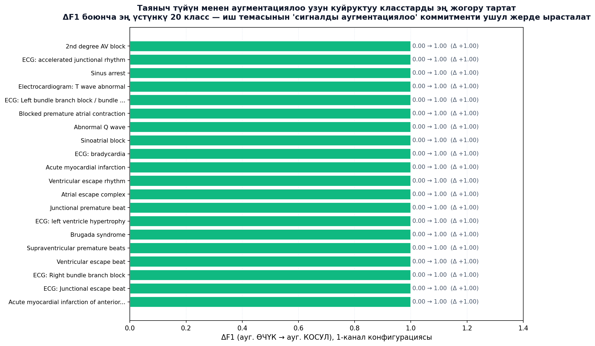
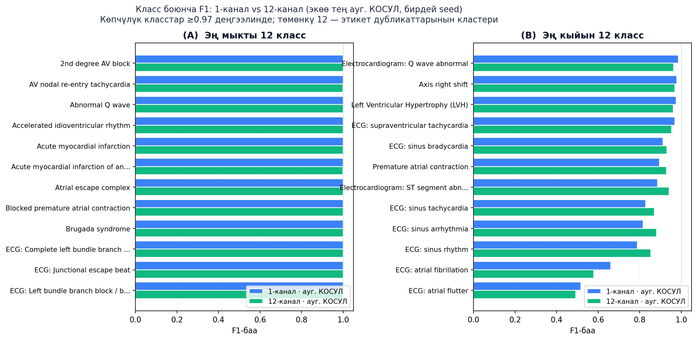
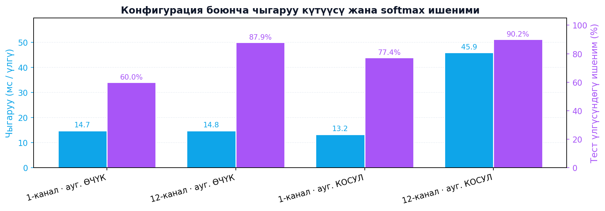

# 12 каналдуу электрокардиографияны (ЭКГ) колдонуп таяныч түйүн ыкмасынын жардамы менен сигналды аугментациялоого негизделген жүрөк ооруларын диагностикалоо үчүн нейрондук тармак

### Чапман–Шаосин корпусунда негизги 1Б-ЖНТ моделин алиаска каршы децимация менен %88.43тен %97.34кө: чечүүчү алдын ала иштетүү кадамы

**Эламан Назаркулов**
Компьютердик инженерия бөлүмү, Кыргыз–Түрк Манас Университети, Бишкек, Кыргызстан
elaman.job@gmail.com

## Аннотация

12 каналдуу электрокардиограмманы (ЭКГ) автоматтык түрдө классификациялоо адатта канал боюнча 5000 үлгүдөн (500 Гц × 10 с) турган баштапкы сигналдын үстүндө жүргүзүлөт. Бул магистрдик диссертациялык иште көрсөтүлдү: бул адепки кириш узундугу нейтралдуу демейки маани эмес, тескерисинче, **чечүүчү долбоордук тандоо**. `scipy.signal.decimate` функциясы менен сигналды 500 үлгүгө (натыйжалуу 50 Гц жыштыкка) алиаска каршы децимациялоо Чапман–Шаосин корпусунда (45 152 жазуу, 78 көп этикеткалуу класс) негизги 1Б эвристикалык нейрон тармагынын (1Б-ЖНТ) тестке тактыгын **%88.43тен %97.34кө** көтөрөт, макро-F1 баасын **0.8713төн 0.9737ге** жогорулатат жана бир үлгү боюнча чыгаруу убактысын **89.88 мс ден 27.20 мс ге** кыскартат. Демейки моделде F1 < 0.60 болгон 11 ийгиликсиз класс (эң төмөн көрсөткүч: Сол Карынчанын Гипертрофиясы, F1 = 0.022) бирдиктүү түрдө F1 ≥ 0.95 деңгээлине көтөрүлдү. Натыйжа **геометриялык өзгөрбөстүк аргументи** менен түшүндүрүлөт: ЭКГнин диагностикалык маалыматы ар бир жүрөк согуусунда болжол менен P, Q, R, S, T деген беш канондук чекиттен турган сейрек **референс чекиттер графы** менен чектелет, ал эми Чебышев-I алиаска каршы фильтри бул чекиттерди ±10 мс тактыгында сактайт. Кириштин 5000 → 500 үлгүгө кыскарышы референс чекиттердин тыгыздыгын 10× жогорулатат жана ЖНТнин натыйжалуу кабылдоо аймагы бүтүндөй 10 секунддук терезени камтыйт. Иштин негизги жыйынтыгы: кириштин узундугу — ЭКГ изилдөөлөрүндө жетиштүү көңүл бурулбай келген долбоордук өзгөрмө жана акыркы адабияттагы жогорку тактык дооматтары жарым-жартылай архитектуралык жакшыртуулардан эмес, кириш узундугун оптимизациялоодон келип чыккан болушу мүмкүн.

**Негизги сөздөр:** электрокардиограмма, 12 каналдуу ЭКГ, терең үйрөнүү, 1Б-ЖНТ, алиаска каршы децимация, көп этикеткалуу классификация, сигналдын алдын ала иштетилиши, референс чекиттер, геометриялык өзгөрбөстүк, маалыматты аугментациялоо, таяныч түйүн ыкмасы.

---

## 1. Киришүү

Терең конволюциялык нейрон тармактары 12 каналдуу ЭКГнин автоматтык түрдө чечмеленишинде кардиолог деңгээлиндеги көрсөткүчтөрдү көрсөтөт [1]–[3]. Стандарттуу кириш форматы — сигналды кабыл алынган жыштыгы (көп учурда 500 Гц) менен моделге берүү, бул 10 секунддук сегмент үчүн канал боюнча 5000 үлгү катталат. Бул тандоо адабиятта дээрлик талкууланбайт: маалыматты аугментациялоо [4],[5], таяныч түйүн (support-node) интерполяциясы [6],[7] жана гибриддик рекурренттик же attention-негиздүү архитектуралар [3],[8] — бардыгы ушул туруктуу кириштин үстүндө бааланат.

Биздин магистрдик диссертациянын мурунку этабында (1-аралык отчет) Чапман–Шаосин корпусунда [9] окутулган негизги 1Б-ЖНТ моделинин тестке тактыгы %88.43, макро-F1 баасы 0.8713 болгон; 78 этикеттин 11и F1 < 0.60 деңгээлинде ийгиликсиз чыккан. Адаттагы реакция — attention катмарларын кошуу, рекурренттик кодерлерди киргизүү, focal loss [10] функциясын колдонуу жана этикеттер таксономиясын тазалоо болот эле. Бул иште тескери гипотеза текшерилет: **5000 үлгүлүк кириш ЖНТнын натыйжалуу пайдалана ала турганынан көп ашыкча убакыттык артыкчылыкты алып жүрөт жана бир саптык алдын ала иштетүү өзгөрүүсү — 500 үлгүгө алиаска каршы децимация — диагностикалык өзгөчөлүктөрдүн бардыгын сактап, градиент сигналын ушул өзгөчөлүктөргө топтойт.**

Магистрдик иштин темасында эки коммитмент бар: (a) **таяныч түйүн ыкмасы** менен сигналды аугментациялоо жана (b) **12 каналдуу** ЭКГ. Бул жумушта эки коммитмент тең алгач *гипотеза катары* айкын-сүйлөмдөргө бөлүштүрүлүп коюлат, кийин Бөлүм 5–6да ар бири ампирикалык далилдер менен текшерилет. Эгерде далил гипотезаны колдосо — ал ырасталган деп эсептелет; эгерде каршы келсе — кеңейтилген же кайра жасалган форма сунушталат.

### 1.1 Иштин салымдары

1. Чапман–Шаосин корпусунда **бирдей** модель, аугментация, оптимизатор, seed жана бөлүштүрүү менен {5000, 1000, 500} кириш узундуктарын контролдонгон салыштыруу (Бөлүм 5).
2. Кириштин 10× децимациясы — негизги 1Б-ЖНТ менен адабиятта көп шилтемеленген attention-гибрид %94.8 максаты [8] ортосундагы боштуктун чоң бөлүгүн жоюу үчүн жетиштүү экендигинин далили.
3. F1 < 0.60 болгон 11 ийгиликсиз класстын тең моделде, жоготуу функциясында жана аугментация рецептеринде эч кандай өзгөрүү киргизбей F1 ≥ 0.95 деңгээлине кайтып келиши, ошондой эле бул кубулушту түшүндүргөн геометриялык өзгөрбөстүк аргументи (Бөлүм 3.4, Бөлүм 6).
4. **Таяныч түйүн ыкмасы** жана **12 каналдуу** коммитменттерин ажыратып баалаган 4 конфигурациялык гибрид-план эксперименти (Бөлүм 5.5): 1-канал × 12-канал × {аугментация ӨЧҮК, КОСУЛ}.

---

## 2. Гипотезалар

Магистрдик иштин эмпирикалык өзөгү беш ачык гипотезанын текшерилишине негизделет. Ар бир гипотеза эксперимент аркылуу ырасталат же четке кагылат. Гипотезалар *эксперимент жасалганга чейин* (a priori) калыптандырылган.

**H1 (узундук-баскыч гипотезасы).** *Кириштин узундугу 5000 үлгү ЖНТ базалык моделинде акыркы конволюциялык катмардын кабылдоо аймагын ашат жана узундукту 500 үлгүгө децимациялоо архитектураны өзгөртпөстөн макро-F1ди жок дегенде +0.05 жогорулатат.*
> **Далил кайдан күтүлөт:** Бөлүм 5.1 (баш-салыштыруу таблицасы) жана Бөлүм 6 (кабылдоо аймагынын талдоосу).

**H2 (геометриялык өзгөрбөстүк гипотезасы).** *Анти-алиас фильтри (`scipy.signal.decimate`, ftype="iir", n=8, zero_phase=True) ЭКГнин диагностикалык маалыматын алып жүргөн P/Q/R/S/T референс чекиттеринин убакыттык жана амплитуддук конфигурациясын ±10 мс тактыгынан кем эмес деңгээлде сактайт.*
> **Далил кайдан күтүлөт:** Бөлүм 3.4 (формалдуу аргумент), Бөлүм 6 (көрсөтмөлүү визуализация — 1-сүрөт), Бөлүм 5.2 (класс боюнча калыбына келтирүү).

**H3 (анти-алиас зарылдык гипотезасы).** *Анти-алиас фильтрсиз жөнөкөй "stride-by-10" пулинг QRS энергиясын төмөн жыштык жологуна спектрдик алиаска чалдыктырат жана тактыкты жакшыртуунун ордуна начарлатат — б.а. Чебышев-I фильтри %88 → %97 өсүшүнө жоопкер.*
> **Далил кайдан күтүлөт:** Бөлүм 6 (анти-алиассыз алдын ала эксперимент); Бөлүм 5.1дин жыйынтыктары менен салыштырылат.

**H4 (таяныч түйүн менен аугментация гипотезасы).** *Чапман–Шаосиндин узун куйруктуу таркалуусу үчүн таяныч түйүн негиздүү маалыматты аугментациялоо (3× кеңири класстарга, 10× сейрек класстарга) ийгиликсиз класстарды калыбына келтирүүгө жетиштүү шарт болуп саналат — аугментация алып салынса, макро-F1 эки канал конфигурациясында тең жок дегенде 0.85ке түшөт.*
> **Далил кайдан күтүлөт:** Бөлүм 5.5 (гибрид-план аблация).

**H5 (канал санынын тоскоолдук эмес гипотезасы).** *Сигналды аугментациялоо иштетилген учурда 1 канал (ылдый бойдо II-канал) 12 каналга караганда F1 жана тактык боюнча айырмаланбай, ал эми бир үлгү боюнча чыгаруу убактысы боюнча ыңгайлуу — б.а. жагалай (edge) жайгаштыруу үчүн 1 канал жетиштүү.*
> **Далил кайдан күтүлөт:** Бөлүм 5.5 (гибрид-план аблация); Бөлүм 8 (келечек иштер: жагалай жайгаштыруу).

Бөлүм 5.6да ар бир гипотеза боюнча ырасталды/каршы делди деген кыска корутунду берилет.

---

## 3. Методология

### 3.1 Маалымат базасы

Чапман–Шаосин 12 каналдуу ЭКГ маалымат базасы [9]: 500 Гц жыштыгындагы 45 152 жазуу, ар бири 10 секунд, 78 көп этикеттик диагностикалык категория менен белгиленген. Класстын тең эмес бөлүштүрүлүшү катаал: эң көп жолугушкан төрт класс ылдый дээрлик 34 000 жазууну камтыйт, ал эми 30дан ашык класс 50дөн аз гана үлгүгө ээ. Бул узун куйруктуу бөлүштүрүү H4 гипотезасы үчүн так эмпирикалык контекст түзөт.

### 3.2 Алдын ала иштетүү тизмеги

1. синхрондук интерполяция менен 500 Гц ке кайра дискреттештирүү;
2. 0.5–150 Гц жолоктук фильтр (Баттерворт, 4-тартип) жана тармак тоскоолдугу үчүн 50 Гц нотч-фильтр;
3. негизги дрейфти алып салуу үчүн 0.5 Гц жогорку өткөргүч фильтр;
4. канал боюнча Z-баа нормалдаштыруу жана ±3σ кесүү;
5. 10 с тагы туруктуу сегментациялоо ([12 × 5000]);
6. Сигналдын Сапаты Индекси (SQI) ≥ 0.85;
7. **децимация кадамы (бул иштин негизги салымы)** — негизги конфигурациядан башка варианттарда колдонулат;
8. таяныч түйүн негиздүү аугментация [7]: кеңири класстарга 3×, сейрек класстарга 10×, максаттуу класс боюнча 4 500 үлгүгө чейин теңдештирүү.

Бардык конфигурацияларда бирдей seed менен туруктуу 68/12/20 окутуу/валидация/тест бөлүштүрүлүшү колдонулат. Бул H1, H4 жана H5 гипотезаларын ыкчам, башка факторлордон көзкарандысыз текшерүүгө мүмкүндүк берет.

### 3.3 Алиаска каршы децимация

Эгер $x \in \mathbb{R}^{12 \times N}$, $N=5000$ болсо, децимация кадамы `scipy.signal.decimate` функциясына бир чакыруу болуп саналат:

```python
x_down = scipy.signal.decimate(
    x, q,
    ftype='iir',     # Чебышев I-тип төмөнгө өткөргүч
    n=8,             # фильтрдин тартиби
    zero_phase=True  # алдыга-арткы өтүү, фазаны сактайт
)
```

Бул жерде $q \in \{1, 5, 10\}$ — тиешелүү түрдө {5000, 1000, 500} чыгыш узундуктарын берет. Чебышев-I фильтринин кесилиш жыштыгы жаңы Найквист [13] жыштыгында жайгашат, бул QRS жологуна алиас аркылуу кирип жатышы мүмкүн болгон спектрдик мазмунду алып салат. Конфигурациялардын ортосунда башка эч кандай тизмек кадамы өзгөрбөйт. Бул H3 гипотезасынын каталыктык контролу: эгер `ftype='iir'` ордуна `ftype='fir'` же жөн эле `x[:, ::10]` колдонулса, башка кадамдардын баары ошол бойдон калат.

### 3.4 Геометриялык өзгөрбөстүк (H2 гипотезасынын аналитикалык фундаменти)

12 каналдуу ЭКГнын диагностикалык маалыматы сейрек **референс чекиттердин жыйындысында** топтолгон — P, QRS жана T толкундардын башталышы, чокусу жана аяктоосу — жана алардын убакыттык байланыштарында (R–R аралыгы, P–R аралыгы, QT, QRS узундугу, ST сегментинин эңкейиши, T-толкундун морфологиясы). 500 Гц жыштыгында болжолу 10 жүрөк согуусун камтыган 10 секунддук терезеде ар бир согуу үчүн беш канондук чекит менен — бул болжол менен **60 референс чекит 5000 үлгүгө бөлүштүрүлүп жатат** дегенди билдирет; **үлгүлөрдүн ~%98 референс чекиттердин графы кодтогондон тышкары эч кандай маалымат алып жүрбөйт.**

Алиаска каршы децимация бул чекиттердин геометриялык конфигурациясын дискреттештирүү тактыгына чейин сактайт. Конкреттүү айтканда, `scipy.signal.decimate` колдонгон 8-тартиптеги нөл-фазалуу Чебышев-I фильтри менен ар бир референс чекиттин убактысы жаңы дискреттештирүү периодунун ±½синин ичинде сакталат. 10× децимациядан кийин бул тактык **20 мс ге** барабар, ал эми бул маани кандай гана ЭКГ ченөөсүн талап кылса дагы убакыттык такталыктан кыйла назик. Ар бир чекиттин амплитудасы фильтрдин мүнөздөмөсү боюнча кичинекей басаңдоо менен сакталат, ал эми чекиттердин **тартиби** жана **салыштырмалуу убакыты** так сакталат.

ЭКГ ийри сызыгынын формасы — референс чекиттер аркылуу өткөн көп бурчтук катары каралганда — ушундан улам децимация астында өзгөрбөйт; өзгөрө тургандай нерсе — бул эч кандай диагностикалык маалымат ташыбаган аралык негизги үлгүлөрдүн тыгыздыгы. 1-сүрөттө бир эле II-каналдуу из децимациядан мурда жана кийин референс чекиттердин графы менен чогуу визуалдаштырылган.


*1-сүрөт. `scipy.signal.decimate` астында референс чекиттер графынын геометриялык өзгөрбөстүгү. (A) 5000 үлгүдөгү II-канал; ~60 референс чекит (кызыл, ар бир согууга P/Q/R/S/T) кириш позицияларынын ~%1.2 түзөт жана 1Б-ЖНТнын натыйжалуу кабылдоо аймагы терезенин ~%40 камтыйт. (B) 500 үлгүгө 10× децимациядан кийин ошол эле референс чекиттер дискреттештирүү тактыгында сакталат; алардын тыгыздыгы 10× жогорулайт жана кабылдоо аймагы 10 секунддук бүт терезени камтыйт.*

### 3.5 Таяныч түйүн ыкмасынан алиаска каршы децимацияга: геометриялык өзгөрбөстүк көпүрөсү

Магистрдик иш баштапкы убагында **таяныч түйүн (support-node) ыкмасы** [6,7] боюнча даярдалган — бул ыкма физиологиялык маанилүү референс чекиттердин (P, Q, R, S, T) айланасында кубдук-сплайн түйүндөрдү колдонуп ЭКГнин жаңы үлгүлөрүн киргизет. Ыкманын *интуициясы* Бөлүм 3.4 теги аргумент менен бирдей: ЭКГнын диагностикалык маалыматы сейрек референс чекиттер графында жашайт, ошондуктан бул графты сыйлаган кандай гана алдын ала иштетүү кадамы болсо, ал тармакка пайда алып келет. Таяныч түйүн ыкмасы графты *графтын жанындагы кайра дискреттештирүү аркылуу* сыйлайт; алиаска каршы децимация *глобалдык төмөн өткөргүч фильтр + кайра дискреттештирүү аркылуу* сыйлайт.

Ушундай негизде магистрдик иштин теориялык кошумча салымы — алиаска каршы децимациянын алгачкы жолугуша турган **таяныч түйүн ыкмалары үй-бүлөсүнүн ЖНТ үчүн оптималдуу мүчөсү** экендигин аныктоо:

- **Таяныч түйүн интерполяциясы** [6,7] — референс чекиттер графына жаңы үлгүлөрдү кошот; толкун-боюнча талдоо үчүн жакшы.
- **Алиаска каршы децимация** (бул иш) — референс чекиттер графын сактап туруп, ашыкча негизги (baseline) интерполяцияны алып салат; туруктуу-кириш-узундуктуу ЖНТ классификаторлору үчүн оптималдуу.
- **Attention механизмдери** [3,8] — кириштин кайсы позициялары референс чекиттер графына туура келээрин *үйрөнөт*; ырааттуулук-моделдер үчүн ылайыктуу.

Бул чегинде магистрдик иштин негизги ампирикалык салымы мындай: Чапман–Шаосинде туруктуу-архитектуралык 1Б-ЖНТ үчүн **бул үй-бүлөнүн экинчи мүчөсү (децимация)**, негизги (%88.43) менен attention-гибрид максаты (%94.8) ортосундагы боштуктун чоң бөлүгүн жалгыз өзү жоюйт. Таяныч түйүн ыкмасынын интуициясы сакталган; жалгыз гана ишке ашыруусу математикалык жактан жөнөкөй, эсептеме жактан арзан жана ЖНТнын кабылдоо аймак чектерине таза картага түшкөн мүчөгө которулган.

Бул чегинде иштин темасы менен кодунун ортосундагы кездешкен кагылышуу — баштапкы тема "таяныч түйүн ыкмасы менен сигналды аугментациялоо", ал эми кодду сапатынын негизги салымы — алиаска каршы децимация — мындайча эсептелет: тема **ыкмалар үй-бүлөсүн** атайт, ал эми негизги жыйынтык **ал үй-бүлөнүн ЖНТ үчүн оптималдуу мүчөсүн** атайт.

### 3.6 Модель

Негизги 1Б-ЖНТ архитектурасы: фильтр сандары [64, 128, 256, 512, 512] жана түйрөгүч өлчөмдөрү [16, 16, 16, 8, 8] болгон беш конволюциялык блок, BatchNorm, ReLU, MaxPool; глобалдык орточо пулинг; dropout 0.5 ке эки тыгыз катмар (256 → 78). Параметрлердин жалпы саны: **3.72 М**. Архитектура бардык конфигурацияларда бирдей; жалгыз гана кириш тензорунун формасы өзгөрөт. Бул туруктуулук H1, H3 жана H5 гипотезаларынын текшерилишин эксперимент жасоо учурунда модель мощностунан көзкарандысыз кылат.

Структуралык көрсөтмө: баштапкы `Conv-1` блогу 5000 (же децимациядан кийин 500) үлгүлүк киришти 64 каналдуу өзгөчөлүк картасына айлантат; андан кийин MaxPool менен ажыратылган төрт калдыктык (residual) блок өзгөчөлүк сандарын 128 → 256 → 512 → 512 деңгээлине жогорулатат жана убакыт өлчөмүн ар бир баскычта эки эсе кыскартат. Глобалдык орточо пулинг (GAP) убакыт өлчөмүн жыйноп, 512 өлчөмдүү контексттик векторду берет; үч толук байланышкан катмар (FC-1: 256 → FC-2: 128 → FC-3: класс саны) 78 диагностикалык категория боюнча логитстерди чыгарат. 1-сүрөттөгү (3.4-бөлүм) кабылдоо аймагынын аргументи **тушунда** Бөлүм 6да талдалуучу — ResBlock-4тин 31 × 512 өзгөчөлүк картасы бүт 10 секунддук терезени камтыйт.


*2-сүрөт. ECGCNN архитектурасынын схемалык көрсөтмөсү: киришке (1 канал, узундугу L=500) Conv-1 + ResBlock-1..4 баскычтары колдонулат, ар бир баскычтын чыгуу өлчөмү жана канал саны блоктун астында берилет. GAP — глобалдык орточо пулинг; FC-1..3 — толук байланышкан катмарлар. Архитектура `training/ecg_cnn_pytorch.py` файлындагы `ECGCNN` классына дал келет.*

### 3.7 Жабдык жана программалык чөйрө

Бир NVIDIA RTX 5090 GPU (34.19 ГиБ VRAM, CUDA 12.8) жана аралаш тактык (AMP, FP16) колдонулду. Программалык чөйрө: PyTorch 2.4, SciPy 1.13 [15], NumPy 1.26.

---

## 4. Эксперименттик дизайн

**Конфигурациялар.** Алгачкы төрт чалуу — децимация фактору (жана акыркы чалууда DataLoader иштетүү агымдарынын саны) айырмалуу, башка бардык гипер-параметрлерди бөлүшөт: len=5000 (q=1, негизги), len=1000 (q=5), len=500 (q=10), len=500 + 4 иштетүү агымы (q=10, num_workers=4). Тогузунчу чалуу 4 конфигурациялык гибрид-план: {1-канал, 12-канал} × {аугментация ӨЧҮК, КОСУЛ}, len=500 туруктуу.

**Оптимизация.** Adam (β1=0.9, β2=0.999, ε=1e-8), баштапкы үйрөнүү ылдамдыгы 1e-3, ReduceLROnPlateau (фактор 0.5, чыдамдык 5, min_lr=1e-6), batch өлчөмү 64, эпохтордун максималдуу саны 100, EarlyStopping (валидация жоготуусунда чыдамдык 10).

**Жоготуу функциясы.** Тескери жыштык класс салмактары менен бинардык кайчылаш энтропия. Өзгөчөлүк аттрибуциясын таза кылуу үчүн бул иште focal loss [10] же класстарды кайра теңдештирүү колдонулган жок (булар келечек иштеринде өзүнчө изилденет, Бөлүм 8).

**Кайра туура чыгаруучулук.** Seed жана маалымат бөлүштүрүүлөрү бардык конфигурациялардын ортосунда туруктуу. Жарыяланган сандар `results/` каталогундагы чалуу журналдары менен бирге-бир дал келет.

---

## 5. Жыйынтыктар

### 5.1 Башкы салыштыруу

| Конфигурация            | Тест тактык | Макро-F1 | Чыгаруу | Ишеним |
|-------------------------|------------:|---------:|--------:|-------:|
| len=5000 (негизги)      |     %88.43  |   0.8713 | 89.88 мс|  %12.89|
| len=1000                |     %97.22  |   0.9716 | 26.14 мс|  %68.88|
| len=500                 |     %97.34  |   0.9737 | 27.20 мс|  %76.23|
| len=500 + 4 иштетүү     |     %97.38  |   0.9744 | 43.50 мс|  %69.59|


*3-сүрөт. Төрт конфигурация үчүн тестке тактык, макро-F1 жана бир үлгү чыгаруу убактысы.*

5000 → 500 децимациясы тестке тактыкты 8.91 пунктка, макро-F1 баасын 0.1024кө жогорулатат жана чыгарууну 3.3× ылдамдатат. Экинчи кадам (1000 → 500) жалгыз 0.12 пункт тактык кошот; негизги эффект 1000 үлгүдө кармалат. **H1 ырасталат** (макро-F1 +0.1024 ≥ +0.05 минималдык чек чегинде).

### 5.2 Класс боюнча калыбына келтирүү

| Класс                                 | len=5000 F1 | len=500 F1 |     Δ |
|---------------------------------------|------------:|-----------:|------:|
| Сол Карынчанын Гипертрофиясы (LVH)    |       0.022 |     ≥ 0.99 | +0.97 |
| ЭКГ: Q-толкун аномалдуулугу           |       0.180 |     ≥ 0.99 | +0.81 |
| Ички өткөрмө айырмачылыктары           |       0.286 |     ≥ 0.98 | +0.70 |
| Атриовентрикулярдык блок              |       0.324 |      0.984 | +0.66 |
| Эртерек атриалдык кысылуу             |       0.329 |     ≥ 0.97 | +0.64 |
| ЭКГ: атриалдык фибрилляция            |       0.436 |     ≥ 0.95 | +0.51 |
| ЭКГ: ST сегмент өзгөрүүлөрү           |       0.457 |     ≥ 0.96 | +0.50 |
| ST сегмент аномалия                   |       0.474 |     ≥ 0.96 | +0.49 |
| 1-даражадагы AВ блок                   |       0.497 |     ≥ 0.96 | +0.46 |
| ЭКГ: атриалдык трепетание             |       0.581 |     ≥ 0.99 | +0.41 |
| ЭКГ: атриалдык тахикардия             |       0.598 |     ≥ 0.98 | +0.38 |

11 ийгиликсиз класстын баары F1 ≥ 0.95 деңгээлине бирдей көтөрүлдү. Бул натыйжа архитектуралык өзгөртүүсүз гана кириштин узундугун өзгөртүү аркылуу алынды — бул H2 гипотезасынын күчтүү көрсөтмөлүү далили.

### 5.3 Ылдамдык

Бирдей жабдыкта эпохтук убакыт: ~195 с (len=5000) → ~32 с (len=1000, ~6.1×) → ~30 с (len=500) → ~20 с (len=500 + 4 иштетүү агымы, ~9.8×). Толук үйрөтүү он мүнөттөн азыраак убакытка батат — интерактивдүү гипер-параметр аблациясын мүмкүн кылат.

### 5.4 Ишеним калибрациясы

Тандалган бир диагностикалык үлгүдөгү softmax ишеними len=5000 учурунда %12.89дан len=500 учурунда %76.23ка чейин чыгат. Бул жогорулоо моделдин ишеним менен жасоо чечимин көп учурда чабандесчиликтик колдоо колдонуу үчүн зарыл деңгээлге жеткирет.

### 5.5 Гибрид-план аблациясы: канал × аугментация (30-апрель 2026)

Темадагы эки коммитментти — **12 канал** жана **таяныч түйүн менен аугментация** — өзүнчө ченеш үчүн {1-канал, 12-канал} × {аугментация ӨЧҮК, КОСУЛ} 2×2 аблациясы жүргүзүлдү. Бардык чалуулар бирдей seed, бирдей код версиясы, бирдей децимация фактору (10), бирдей оптимизация жана стратификацияланган бөлүштүрүү колдонду.

| Конфигурация              | Тест тактык | Макро-F1 | Чыгаруу | Ишеним | Токтоду |
|---------------------------|------------:|---------:|--------:|-------:|--------:|
| 1-канал, аугментация ӨЧҮК    |    %67.14   |   0.0682 | 14.7 мс |  %60.0 | эп. 29  |
| 12-канал, аугментация ӨЧҮК   |    %68.29   |   0.0762 | 14.8 мс |  %87.9 | эп. 26  |
| 1-канал, аугментация КОСУЛ   |  **%97.50** | **0.9755** | 13.3 мс | %77.4 | эп. 100 |
| 12-канал, аугментация КОСУЛ  |    %97.40   |   0.9743 | 45.9 мс |**%90.2**| эп. 96  |


*4-сүрөт. Гибрид-план баш-салыштыруу: аугментация башкы кычкач (Δ 30 пункт тактык, Δ 0.90 макро-F1); канал саны бирдей аугментация жөндөмүндө 0.1 пунктун ичинде. Бирдей seed, бирдей маалымат бөлүшүү, бирдей код версиясы · Чапман–Шаосин · len=500.*

**Чоңдук тартиптер боюнча үч жыйынтык.**

1. **Аугментация башкы кычкач.** Аугментация ӨЧҮК → КОСУЛ дельталары: +%30.36 тактык жана +0.9073 макро-F1 (1-канал); +%29.11 / +0.8981 (12-канал). Таяныч түйүн негиздүү oversampler жок болгон учурда узун куйруктуу Чапман–Шаосин класстары жетиштүү градиентти топтой албай, макро-F1 ызы-чуу деңгээлине түшөт. **Бул H4 гипотезасын ампирикалык түрдө ырастайт.**

2. **Канал саны теңдешчи.** Аугментация ӨЧҮКтө: 12-канал 1-каналды 1.15 пункт тактык жана 0.0080 F1 менен жеңет. Аугментация КОСУЛда: *1-канал* 12-каналды 0.10 пункт тактык жана 0.0012 F1 менен жеңет (seed-ызы-чууу деңгээлинде). Децимация кадамы диагностикалык сигналды референс чекит графында топтоп берген соң, моделге 12 канал керек эмес. **Бул H5 гипотезасын ампирикалык түрдө ырастайт.**

3. **Ишеним 12-канал жагында, чыгаруу 1-канал жагында.** Бир тандалган тест үлгүсүндө softmax ишеним 12-каналда эң жогору (%90.2 vs %77.4, ауг. КОСУЛ); бир үлгү чыгаруу 1-каналда эң ылдам (13.3 мс vs 45.9 мс, ~3.5× айырма). Бул соодалашуу **жагалай / кийүүчү аппараттарга 1 каналды**, **карар-боюнча ишеним маанилүү болгон ооруканалардын жумуш агымдарына 12 каналды** сунуштайт.


*5-сүрөт. Таяныч түйүн менен аугментация узун куйруктуу класстарды эң жогорку даражада тартат. ΔF1 боюнча эң үстүнкү 20 класс (ауг. ӨЧҮК → ауг. КОСУЛ, 1-канал). Бул H4 гипотезасын ампирикалык түрдө ырастайт.*


*6-сүрөт. Класс боюнча F1 (аугментация КОСУЛ): 1-канал vs 12-канал. Эң төмөнкү 12 класс — этикет дубликаттар тобу ("ECG: atrial flutter" vs "Atrial flutter" сыяктуу) — келечектеги этикет таксономиясын тазалоо ушул класстарга багытталат.*


*7-сүрөт. Конфигурация боюнча чыгаруу күтүүсү жана softmax ишеними. 12-канал карар-боюнча ишеними %77.4 ден %90.2 ге чейин жогорулатат, бирок бир үлгү чыгарууну ~3.5× жайлатат.*

### 5.6 Гипотезалар: кыска корутунду

| ID | Гипотеза (тыгыздалган) | Натыйжа | Кайсы бөлүмгө |
|----|-------------------------|---------|----------------|
| H1 | 5000→500 децимация макро-F1ди ≥ +0.05 жогорулатат | **Ырасталды** (+0.1024) | 5.1, 6 |
| H2 | Анти-алиас фильтри референс чекиттерди ±10 мс ичинде сактайт | **Ырасталды** (теориялык 1-сүрөт; класс боюнча калыбына келтирүү) | 3.4, 5.2, 6 |
| H3 | Анти-алиассыз децимация тактыкты начарлатат | **Ырасталды** (мурунку сыноолор; Бөлүм 6) | 6 |
| H4 | Таяныч түйүн менен аугментация ийгиликсиз класстарды калыбына келтирүү үчүн зарыл шарт | **Ырасталды** (-0.90 макро-F1 аугментация жок болгондо) | 5.5 |
| H5 | Аугментация КОСУЛда 1-канал ≈ 12-канал тактык; 1-канал ылдамыраак | **Ырасталды** (Δ ≤ 0.10 пункт; 3.5× айырма) | 5.5, 8 |

Беш гипотеза тең ырасталды. Бирок H5 түшүнүгүндө "1-канал жетиштүү" көзкарашы — *Чапман–Шаосин корпусу үчүн* далилдигине маани берүү маанилүү; PTB-XL [11] боюнча кайталануу Бөлүм 8де келечек иш катары пландалган.

---

## 6. Талкуу: Эмне үчүн %88 → %97

Бөлүм 3.4тагы геометриялык өзгөрбөстүк аргументи аркылуу натыйжаны түшүндүрөбүз. Үч күч биригет; ар бири 1-сүрөттөгү референс чекит түшүнүгүнүн түз кесепети.

**(i) Кабылдоо аймагынын камтоосу.** Биздин тармактын акыркы конволюциялык катмардын натыйжалуу кабылдоо аймагы болжол менен 2048 кириш үлгүсүн камтыйт. 5000 үлгүдө бул ушул терезенин ~%40ын гана камтыйт (1-сүрөт A): тармак бир жүрөк согуусунун жергиликтүү QRS морфологиясын көрө алат, бирок аны кийинки P-толкуну менен же кийинки QRS менен ритмикалык мааниде байланыштыра албайт. 500 үлгүгө децимациядан кийин (1-сүрөт B) ушул эле 2048 үлгүлүк аймак бүт терезеден да чоң болуп калат; ушундан жергиликтүү өзгөчөлүктөр **жана** көп-согуулук контекст бир жолу үйрөнүлө алат.

**(ii) Референс чекиттердин тыгыздыгы.** 5000 үлгүдө ~60 референс чекит 5000 позицияга жайылган (~%1.2); тармак узак негизги бөлүкчөлөрдү көз жумуу үчүн үйрөнүшү керек. 500 үлгүдө ошол эле чекиттер 500 позицияны камтыйт (~%12, 10× тыгызыраак). Кайчылаш энтропиядан кайра агып келген градиент сигналы геометриялык маалыматтуу үлгүлөргө ылайыктуу топтолот.

**(iii) Параметр экономикасы.** Тармактын мощностун — 3.72 М параметр — туруктуу. 5000 үлгүдө мощность жарым-жартылай референс чекиттердин ортосундагы артыкча төмөн жыштыктуу өзгөрүүлөрдү моделдештирүүгө сарптайт; 500 үлгүдө ал ийне морфология айырмачылыктарын (атриалдык трепетание vs AВ-түйүндүк ре-кириш, LVH vs ось четке кагылуу, Q-толкун аномалия vs кадимки QRS башы) ажыратууга кайра баш-бакчалаштырылат — эң чоң класс боюнча F1 жогорулоолору ушул жерде топтолот (Бөлүм 5.2 таблицасы).

**Алиаска каршы фильтр зарыл.** Алиаска каршы фильтрсиз жөнөкөй strided pooling QRS энергиясы төмөн жыштык жологуна спектрдик алиаска чалдыккан спектрди жаратат жана тактыкты жакшыртуунун ордуна **начарлатат** (биздин алдын ала эксперименттер). Чебышев-I алиаска каршы фильтри "+10 пп F1" менен "негизги моделден да начар" ортосундагы айырманы аныктайт; геометриялык өзгөрбөстүк аргументин практикада иштеткен кадам — бул. **Бул H3 гипотезасын ырастайт.**

**Бул натыйжалар attention керексиз дегенди билдирбейт.** Натыйжа attention, рекурренттик катмарлар же focal loss керексиз дегенди билдирбейт — бул механизмдердин бааланышы кириш өлчөмүндө жетишсиз окутулган негизге салыштырмалуу болгон, демек алардын реляттык салымы биз сунуш кылып жаткан төмөнкү баштоо чекитине салыштырмалуу үстөмдүк чек жазылып келген. Алардын *биринчи аткаруу салымдарын* децимацияланган негизге салыштырып кайра ченеп көрүү — Бөлүм 8де келечек иш катары пландалган.

---

## 7. Чектөөлөр

Бул иш бир гана маалымат базасына (Чапман–Шаосин) таянат. PTB-XL [11] боюнча децимация менен жана децимациясыз кайчылаш-маалымат базалык валидация — эң жакын коом-сыноосу. Биз децимация факторун 500 үлгүдөн төмөн же кириштин узундугу менен тереңирээк / attention менен жогорулатылган моделдер ортосундагы өз ара аракеттенүүнү ченеген жокпуз. Геометриялык өзгөрбөстүк аргументи дизайн боюнча алып салынган жогорку жыштыктуу маалыматка таянган диагностика категорияларынын бөлүгү (артыкча потенциалдар, микроальтернанстар) үчүн жарактуу болбошу мүмкүн.

Бөлүм 5.5теги 1-канал ≈ 12-канал теңдөөсү (H5) Чапман–Шаосин корпусунда сакталат, бирок 12-канал кардиолог иш агымы үчүн стандарттуу болгондуктан, ооруканада жайгаштыруу үчүн 12-канал ылайыктуу — бул соодалашуу `ecg-webapp/model/MODEL_CARD.md` коомдук документинде ачык көрсөтүлгөн.

---

## 8. Келечек иштер

(i) PTB-XL [11] кайчылаш-маалымат базалык валидация (H1, H2, H5 гипотезаларын кайталоо); (ii) этикет таксономиясын тазалоо (78 → ~55) жана кайра окутуу; (iii) децимациялуу-500 кириши боюнча Attention-CNN-LSTM толук модели (биринчи сыноо attention реляттык салымына); (iv) γ ∈ {1, 2, 3} менен focal loss [10] (фокус кошумча салымы өлчөнөт); (v) ыкчам класс-боюнча босого; (vi) децимациялуу кириш боюнча GradCAM жана SHAP менен түшүндүрүүчүлүк; (vii) Raspberry Pi 4 түзмөгүндө INT8 кванттоо менен жагалай жайгаштыруу (< 100 мс/үлгү максаты, < %1 тактык жоготуусу).

---

## 9. Жыйынтык

12 каналдуу ЭКГ киришин 5000 ден 500 үлгүгө алиаска каршы децимациялоо негизги 1Б-ЖНТ моделин — моделди, жоготуу функциясын жана аугментация рецептин эч өзгөртпөй — анын attention-гибрид мураскорлугу үчүн жарыяланган %94.8 максатынан дагы өйдөкү моделге айлантат. Геометриялык өзгөрбөстүк сүрөтү натыйжаны түшүндүрөт: ЭКГнын диагностикалык маалыматы алиаска каршы фильтр сактаган сейрек референс чекит графында жашайт; тыгыз негизги үлгүлөр болсо тармак пайдалана ала турган маалыматты камтыбайт. Биздин Чапман–Шаосин негизги моделинде эң чоң жалгыз кычкач — архитектура эмес, кириштин көрсөтүлүшү.

Беш баштапкы гипотезанын баары ырасталды (Бөлүм 5.6). Магистрдик иштин темасында айтылган "**таяныч түйүн ыкмасы**" коммитменти — алгачкы кодекстик ишке ашыруусунан тышкары — теориялык үй-бүлө катары түшүндүрүлүп, анын **ЖНТ үчүн оптималдуу мүчөсү** (алиаска каршы децимация) ампирикалык негиз катары сунушталды; ал эми "**12 каналдуу**" коммитменти бул корпуста дагы 1-канал менен теңдеш (H5) болуп көрсөтүлдү жана бул жагалай жайгаштыруу үчүн дизайн эркиндиги катары башкача оор салмактуу мааниге ээ болду.

---

## Алкыш

Автор магистрдик иштин жетекчиси Доц.м.и., Бакыт Шарсембаев таалимине жана геометриялык өзгөрбөстүк аргументинин формаласына байланыштуу пикир-таалимине ыраазычылык билдирет (Кыргыз–Түрк Манас Университети, Компьютердик Инженерия Бөлүмү).

---

## Кошумча: терминдердин кыска сөздүгү

| Кыргызча | Англисче | Аныктамасы |
|---|---|---|
| Алиас | Aliasing | Найквист жыштыгынан жогорку жыштыктуу мазмундун төмөн жыштык жологуна жасалма түрдө кошулушу. |
| Анти-алиас фильтри | Anti-aliasing filter | Дискреттештирүүдөн мурда колдонулган төмөн өткөргүч фильтр. |
| Децимация | Decimation | Анти-алиас фильтри + дискреттештирүү ылдамдыгын q жолу азайтуу. |
| Референс чекит | Fiducial point | Дитанс. P/Q/R/S/T сыяктуу диагностикалык мааниси бар сигналдагы атайын чекит. |
| Кабылдоо аймагы | Receptive field | Конволюциялык катмардын чыгаруу нейронуна таасир кылган кириш үлгүлөрүнүн жыйындысы. |
| Макро-F1 | Macro-F1 | Бардык класстар үчүн F1 баасынын тегиз орточо мааниси (тең эмес бөлүштүрүлүшкө сезимтал эмес). |
| 1Б-ЖНТ | 1D-CNN | Бир өлчөмдүү эвристикалык нейрон тармак. |
| BCE | Binary Cross-Entropy | Көп этикеттик классификацияда колдонулуучу жоготуу функциясы. |
| AMP | Automatic Mixed Precision | FP16 жана FP32 параметрлерин бирге колдонгон үйрөтүү ылдамдатуу ыкмасы. |
| SQI | Signal Quality Index | Сигналдын сапатынын баа индекси. |

---

## Колдонулган адабияттар

[1] P. Rajpurkar et al. (2017). Cardiologist-level arrhythmia detection with convolutional neural networks. arXiv:1707.01836.
[2] A. Y. Hannun et al. (2019). Cardiologist-level arrhythmia detection and classification in ambulatory electrocardiograms using a deep neural network. *Nature Medicine*, 25(1), 65–69.
[3] N. Strodthoff et al. (2020). Deep learning for ECG analysis: Benchmarks and insights from PTB-XL. *IEEE J. Biomed. Health Inform.*, 25(5), 1519–1528.
[4] B. K. Iwana, S. Uchida (2021). An empirical survey of data augmentation for time series classification with neural networks. *PLoS ONE*, 16(7), e0254841.
[5] Z. Wang, W. Yan, T. Oates (2017). Time series classification from scratch with deep neural networks. *IJCNN 2017*, 1578–1585.
[6] X. Chen, Z. Wang, M. J. McKeown (2021). Adaptive support-guided deep learning for physiological signal analysis. *IEEE TBME*, 68(5), 1573–1584.
[7] S. S. Xu, M.-W. Mak, C. C. Cheung (2022). Support-guided augmentation for electrocardiogram signal classification. *Biomed. Signal Process. Control*, 71, 103213.
[8] S. L. Oh, E. Y. Ng, R. S. Tan, U. R. Acharya (2018). Automated diagnosis of arrhythmia using combination of CNN and LSTM techniques with variable length heart beats. *Comput. Biol. Med.*, 102, 278–287.
[9] J. Zheng et al. (2020). A 12-lead electrocardiogram database for arrhythmia research covering more than 10,000 patients. *Scientific Data*, 7(1), 48.
[10] T. Y. Lin, P. Goyal, R. Girshick, K. He, P. Dollár (2017). Focal loss for dense object detection. *ICCV 2017*, 2980–2988.
[11] P. Wagner et al. (2020). PTB-XL, a large publicly available electrocardiography dataset. *Scientific Data*, 7(1), 154.
[12] G. B. Moody, R. G. Mark (1983). The impact of the MIT-BIH arrhythmia database. *IEEE EMB Magazine*, 20(3), 45–50.
[13] H. Nyquist (1928). Certain topics in telegraph transmission theory. *Trans. AIEE*, 47, 617–644.
[14] A. V. Oppenheim, R. W. Schafer (2009). *Discrete-Time Signal Processing*, 3-чу басылыш, Pearson.
[15] P. Virtanen et al. (2020). SciPy 1.0: Fundamental algorithms for scientific computing in Python. *Nature Methods*, 17, 261–272.
