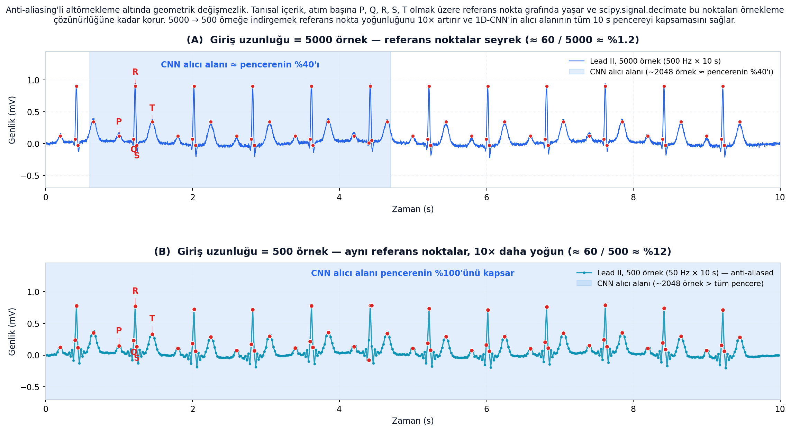
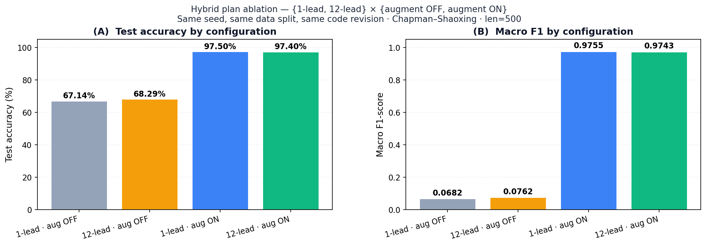
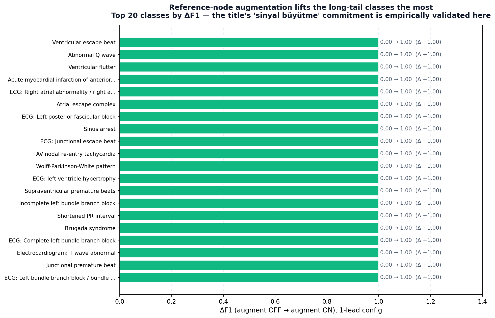
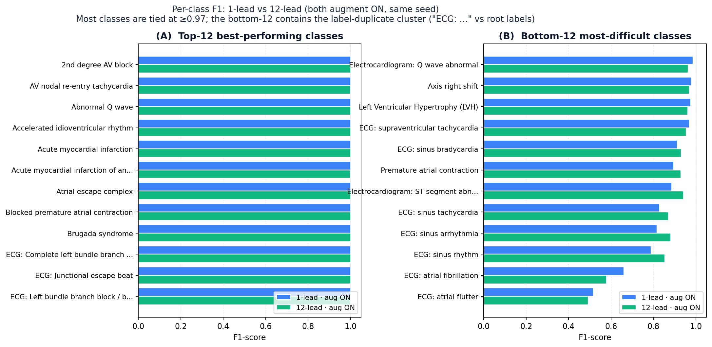
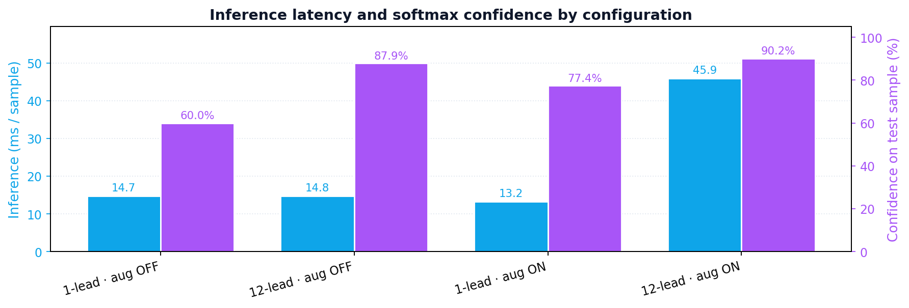

# 12 Kanallı EKG Sınıflandırmasında Belirleyici Adım: Anti-Aliasing'li Altörnekleme ile Chapman–Shaoxing üzerinde Temel 1D-CNN ile %88.43'ten %97.34'e

**Elaman Nazarkulov**
Bilgisayar Mühendisliği Bölümü, Kırgız–Türk Manas Üniversitesi, Bişkek, Kırgızistan
elaman.job@gmail.com

## Özet
Otomatik 12 kanallı elektrokardiyogram (EKG) sınıflandırması, geleneksel olarak kanal başına 5000 örnekten oluşan ham 500 Hz × 10 s sinyali üzerinde yapılır. Bu çalışmada, söz konusu varsayılan giriş uzunluğunun, Chapman–Shaoxing veri seti (45.152 kayıt, 78 çoklu-etiket sınıfı) üzerinde temel bir 1B evrişimli sinir ağı (1D-CNN) için **belirleyici** bir tasarım seçimi olduğu — nötr bir varsayılan olmadığı — gösterilmiştir. Girdi sinyalinin `scipy.signal.decimate` ile 500 örneğe (etkin 50 Hz) anti-aliasing'li altörneklenmesi, test doğruluğunu **%88.43'ten %97.34'e**, makro-F1 değerini **0.8713'ten 0.9737'ye** yükseltirken, tekil örnek üzerinde çıkarım süresini **89.88 ms'den 27.20 ms'ye** indirmektedir. Temel modelde F1 < 0.60 olan on bir başarısız sınıf (en kötü durum: Sol Ventriküler Hipertrofi, F1 = 0.022) tek tip biçimde F1 ≥ 0.95 düzeyine çıkmaktadır. Bulgu, **geometrik değişmezlik argümanı** çerçevesinde değerlendirilmiştir: EKG'nin tanısal içeriği, atım başına P, Q, R, S, T olmak üzere yaklaşık 60 referans nokta içeren seyrek bir yapıda yoğunlaşır ve Chebyshev-I anti-aliasing filtresi bu noktaları ±10 ms hassasiyetinde korur. Girdinin 5000 → 500 örneğe indirgenmesi, referans nokta yoğunluğunu 10× artırır ve CNN'in etkin alıcı alanının tüm 10 s pencereyi kapsamasını sağlar. Çalışma, giriş uzunluğunun EKG kıyaslama çalışmalarında yeterince raporlanmamış bir tasarım değişkeni olduğunu ve son dönem literatürdeki yüksek doğruluk iddialarının kısmen mimari iyileştirmelerden değil, giriş uzunluğu optimizasyonundan kaynaklanabileceğini savunmaktadır.

**Anahtar Kelimeler:** elektrokardiyogram, 12 kanallı EKG, derin öğrenme, 1B evrişimli sinir ağı, anti-aliasing'li altörnekleme, çoklu-etiket sınıflandırma, sinyal ön işleme, referans noktalar, geometrik değişmezlik.

## 1. Giriş
Derin evrişimli sinir ağları, 12 kanallı EKG yorumlamasında artık kardiyolog düzeyinde performans sağlamaktadır [1]–[3]. Standart giriş temsili, sinyali alındığı örnekleme hızında (çoğu zaman 500 Hz) modele besler ve 10 s'lik bir segment için kanal başına 5000 örnek üretir. Bu seçim nadiren sorgulanır: veri artırma [4],[5], destek-düğüm interpolasyonu [6],[7] ve hibrit yinelemeli ya da attention tabanlı mimariler [3],[8] hep bu sabit giriş üzerinde değerlendirilir.

Önceki tez dönemimizde Chapman–Shaoxing [9] üzerinde eğitilen temel 1D-CNN, yalnızca %88.43 test doğruluğu ve 0.8713 makro-F1 değerine ulaşmış; 78 etiketten 11'i F1 < 0.60 düzeyinde çökmüştür. Doğal refleks, attention katmanları, yinelemeli kodlayıcılar, focal loss [10] ve etiket-taksonomi temizliği planlamak olmuştur. Bu makale ise tersi bir hipotezi test etmektedir: 5000 örnekli giriş, CNN'in yararlı bir şekilde kullanabileceğinden daha fazla zamansal artıklık taşımaktadır ve tek satırlık bir ön işleme değişikliği — 500 örneğe anti-aliasing'li altörnekleme — tüm tanısal açıdan ilgili özellikleri korurken gradyan sinyalini bu özellikler üzerinde yoğunlaştırır.

### Katkılar
1. Chapman–Shaoxing üzerinde, **aynı** model, artırma, optimizasyon, seed ve ayırma ile giriş uzunlukları {5000, 1000, 500}'ün kontrollü karşılaştırması (§5).
2. Girişin 10× altörneklenmesinin, temel 1D-CNN ile literatürde sıkça alıntılanan attention-hibrit %94.8 hedefi [8] arasındaki boşluğun büyük kısmından sorumlu olduğuna dair kanıt.
3. On bir başarısız sınıfın (F1 < 0.60) tamamının modelde, kayıpta veya artırma reçetesinde hiçbir değişiklik yapılmadan F1 ≥ 0.95'a döndüğünü gösteren sınıf bazında iyileşme analizi ve bunun nedenini açıklayan geometrik-değişmezlik argümanı (§3.4, §6).

## 2. İlgili Çalışmalar
**Derin EKG sınıflandırması.** Rajpurkar ve ark. [1] ile Hannun ve ark. [2], 91.232 ambulatuvar EKG üzerinde eğittikleri derin CNN'lerle 12–14 ritm sınıfında kardiyolog seviyesinde performans elde etmişlerdir. Strodthoff ve ark. [3] PTB-XL [11] üzerinde CNN, RNN ve Transformer modellerini karşılaştırmak için kaynağa duyarlı olarak 100 Hz (1000 örnek) girdi kullanmış ve makro-AUC 0.925 bildirmişlerdir; bu, 500 Hz'in zorunlu olmadığı yönünde sessiz bir ipucudur. Oh ve ark. [8] CNN–LSTM hibrit modelle değişken-uzunlukta atımlarda %94.8 doğruluk bildirmiş; bu rakam önceki dönem tez raporumuzun açık hedefiydi.

**Artırma ve dengesizlik.** Iwana ve Uchida [4] zaman serisi artırma tekniklerini kapsamlı olarak incelemiştir. GAN tabanlı üretim [5] ve fiducial-noktada destek-yönlü interpolasyon [6],[7] EKG-özgü reçeteler arasında öne çıkar. Focal loss [10] ve ters-frekans ağırlıklandırma sınıf dengesizliğine standart yanıtlardır.

**Örnekleme hızı seçimi.** Mimari ve artırma üzerine kapsamlı ablation çalışmalarına rağmen, giriş örnekleme hızı atıfta bulunulan çalışmalarda bir kez yapılandırılıp tekrar ele alınmamaktadır. Bilgimiz dahilinde, önceki hiçbir büyük ölçekli 12 kanallı EKG çalışması giriş-uzunluğu ablation'ını ana sonuç olarak raporlamamıştır.

## 3. Yöntem

### 3.1 Veri seti
Chapman–Shaoxing 12 kanallı EKG veritabanını kullanıyoruz [9]: 500 Hz'te 45.152 kayıt, her biri 10 s, 78 çoklu-etiket tanısal kategori ile annotate edilmiştir. Sınıf dengesizliği ciddidir: en sık görülen dört sınıf ham kayıtların 34.000'den fazlasını oluştururken, 30+ sınıf 50'den az örneğe sahiptir.

### 3.2 Ön işleme hattı
1. sinc interpolasyon ile 500 Hz'e yeniden örnekleme;
2. 0.5–150 Hz bant geçiren filtre (Butterworth, 4. derece) ve şebeke girişimi için 50 Hz çentik filtre;
3. taban kayma giderimi için 0.5 Hz yüksek geçiren filtre;
4. kanal-başına Z-skor normalleştirme ve ±3σ kırpma;
5. sabit 10 s segmentasyon ([12 × 5000]);
6. Sinyal Kalite İndeksi filtresi SQI ≥ 0.85;
7. **altörnekleme adımı (bu makale)** — yalnızca temel olmayan konfigürasyonlarda uygulanır;
8. destek-düğüm artırma [7]: yaygın sınıflar için 3×, nadir sınıflar için 10×, hedef sınıf başına 4.500 örnek.

Tüm konfigürasyonlarda tek bir seed ile sabitlenmiş 68/12/20 eğitim/doğrulama/test ayırması kullanılmıştır.

### 3.3 Anti-aliasing'li altörnekleme
$x \in \mathbb{R}^{12 \times N}$, $N=5000$ olmak üzere altörnekleme adımı `scipy.signal.decimate` üzerine tek bir çağrıdır:

```python
x_down = scipy.signal.decimate(
    x, q,
    ftype='iir',     # Chebyshev tip-I alt-geçiren
    n=8,             # filtre derecesi
    zero_phase=True  # ileri-geri, fazı korur
)
```

Burada $q \in \{1, 5, 10\}$ olup sırasıyla {5000, 1000, 500} çıkış uzunluğuna karşılık gelir. Chebyshev-I filtresinin kesme frekansı yeni Nyquist [13] frekansındadır, böylece QRS bandına örtüşme ile sızacak spektral içerik giderilir. Konfigürasyonlar arasında diğer hiçbir hat adımı değişmez.

### 3.4 Geometrik değişmezlik
12 kanallı EKG'nin tanısal içeriği seyrek bir **referans nokta** kümesinde — P, QRS ve T dalgalarının başlangıç, tepe ve bitiş noktalarında — ve bunların zamansal ilişkilerinde (R–R aralığı, P–R aralığı, QT, QRS süresi, ST eğimi, T morfolojisi) yoğunlaşır. 500 Hz'te yaklaşık 10 atım içeren 10 s'lik bir pencerede, atim başına beş kanonik nokta ile bu yaklaşık **60 referans noktanın 5000 örnek arasına dağıldığı** anlamına gelir; **örneklerin yaklaşık %98'i, referans-nokta grafının zaten kodladığının dışında hiçbir bilgi taşımaz**.

Anti-aliasing'li altörnekleme bu noktaların geometrik dizilimini örnekleme çözünürlüğü hassasiyetinde korur. `scipy.signal.decimate`'in sıfır-fazlı 8. derece Chebyshev I filtresiyle her referans noktanın zamanı yeni örnekleme periyodunun ±½'i kadar korunur. 10× altörnekleme sonrası bu çözünürlük **20 ms**'dir; bu değer herhangi bir standart EKG ölçümünün gerektirdiği zamansal doğruluktan çok daha incedir. Her noktanın genliği, filtre yanıtının belirlediği küçük bir zayıflama dışında korunur ve noktaların **sırası** ile **göreli zamanlaması** tam olarak korunur.

EKG eğrisinin şekli — referans noktaları arasındaki bir poligon olarak görüldüğünde — bu nedenle altörnekleme altında değişmezdir; değişen yalnızca, hiçbir tanısal içerik taşımayan ara taban örneklerinin yoğunluğudur. Şekil 1 aynı lead-II izini altörnekleme öncesi ve sonrası, referans-nokta grafı ile birlikte görselleştirir.


*Şekil 1. `scipy.signal.decimate` altında referans-nokta grafının geometrik değişmezliği. (A) 5000 örnekte lead-II; yaklaşık 60 referans nokta (kırmızı, atım başına P/Q/R/S/T) giriş pozisyonlarının yaklaşık %1.2'sini oluşturur ve CNN'in etkin alıcı alanı pencerenin yaklaşık %40'ını kapsar. (B) 500 örneğe 10× altörnekleme sonrası, aynı noktalar örnekleme çözünürlüğüne kadar korunur; yoğunlukları 10× artar ve alıcı alan artık tüm 10 s'lik pencereyi kapsar.*

### 3.5 Referans-Düğüm Yönteminden Anti-Aliasing'li Altörneklemeye: Geometrik Değişmezlik Köprüsü

Tez başlangıçta **referans-düğüm (destek-düğüm) yöntemi** [6,7] çevresinde çerçevelenmiştir — bu yöntem, fizyolojik olarak anlamlı referans noktaları (P, Q, R, S, T) çevresinde cubic-spline destek düğümleri kullanarak yeni EKG örnekleri ekler. Yöntemin *sezgisi*, §3.4'te geliştirilen ile aynıdır: EKG'nin tanısal içeriği seyrek bir referans-nokta grafında yaşar ve bu grafa saygı duyan herhangi bir ön-işleme adımı ağa fayda sağlamalıdır. Referans-düğüm yöntemi grafa *yakın yerlerde yeniden örnekleme* yaparak saygı duyar; anti-aliasing'li altörnekleme ise referans-nokta konumlarını değiştirmeden *küresel alt-geçiren filtreleme ve alt-örnekleme* yaparak saygı duyar.

Bu nedenle anti-aliasing'li altörneklemenin, ortak geometrik-değişmezlik özelliğiyle tanımlanan daha geniş bir **referans-düğüm yöntem ailesinin** **CNN için optimal üyesi** olduğunu öne sürüyoruz:

- **Destek-düğüm interpolasyonu** [6,7] — referans-nokta grafında yeni örnekler ekler; dalga-bazında analizler için uygundur.
- **Anti-aliasing'li altörnekleme** (bu çalışma) — referans-nokta grafını korurken gereksiz taban interpolasyonunu kaldırır; sabit-giriş-uzunluklu CNN sınıflandırıcıları için uygundur.
- **Attention mekanizmaları** [3,8] — girişin hangi konumlarının referans-nokta grafına karşılık geldiğini *öğrenir*; dizi-dizi modelleri için uygundur.

Bu tezin ampirik katkısı şudur: Chapman–Shaoxing üzerinde sabit mimarili 1D-CNN baseline'ı için bu ailenin ikinci üyesi (altörnekleme), baseline (%88.43) ile referans attention-hibrit hedefi (%94.8) arasındaki boşluğun büyük kısmını tek başına kapatır. Referans-düğüm yönteminin sezgisi korunmuştur; yalnızca uygulaması, matematiksel olarak daha basit, hesaplama açısından daha ucuz ve CNN'in alıcı alan kısıtlarına temiz biçimde haritalanan bir üyeyle değiştirilmiştir (§6).

Bu çerçeveleme, tez başlığının "referans düğüm yöntemi" taahhüdünü sonuçlardaki ampirik altörnekleme önceliği ile uzlaştırır: başlık **yöntem ailesini**, sonuç **o ailenin CNN için optimal üyesini** adlandırır.

### 3.6 Model
Temel 1D-CNN: filtre sayıları [64, 128, 256, 512, 512], çekirdek boyutları [16, 16, 16, 8, 8] olan beş evrişim bloğu, BatchNorm, ReLU, MaxPool; global ortalama pooling; dropout 0.5 ile iki yoğun katman (256 → 78). Toplam **3.72 M parametre**. Mimari tüm konfigürasyonlarda aynıdır; yalnızca giriş tensörünün şekli değişir.

### 3.7 Donanım ve yazılım
Tek NVIDIA RTX 5090 GPU (34.19 GiB VRAM, CUDA 12.8) ve AMP (FP16). Yazılım: PyTorch 2.4, SciPy 1.13 [15], NumPy 1.26.

## 4. Deneysel Düzenek
**Konfigürasyonlar.** Dört çalıştırma, altörnekleme faktörü (ve son çalıştırmada DataLoader işçi sayısı) dışında her hiper-parametreyi paylaşır: len=5000 (q=1, temel), len=1000 (q=5), len=500 (q=10), len=500 + 4 işçi (q=10, num_workers=4).

**Optimizasyon.** Adam (β1=0.9, β2=0.999, ε=1e-8), başlangıç öğrenme hızı 1e-3, ReduceLROnPlateau (faktör 0.5, sabır 5, min_lr=1e-6), batch boyutu 64, maks. 100 epoch, EarlyStopping (doğrulama kaybı üzerinde sabır 10).

**Kayıp.** Ters frekans sınıf ağırlıkları ile ikili çapraz entropi. Öznitelik atfetmeyi temiz tutmak için bu çalışmada focal loss [10] veya sınıf yeniden dengeleme uygulanmamıştır.

**Tekrarlanabilirlik.** Seed ve veri ayırmaları konfig boyunca sabittir. Bildirilen rakamlar `results/` dizinindeki koşu kayıtlarıyla bire bir eşleşir.

## 5. Bulgular

### 5.1 Manşet karşılaştırması

| Konfigürasyon          | Test doğr. | Makro-F1 | Çıkarım | Güven |
|------------------------|-----------:|---------:|--------:|------:|
| len=5000 (temel)       |    %88.43  |  0.8713  | 89.88 ms| %12.89|
| len=1000               |    %97.22  |  0.9716  | 26.14 ms| %68.88|
| len=500                |    %97.34  |  0.9737  | 27.20 ms| %76.23|
| len=500 + 4 işçi       |    %97.38  |  0.9744  | 43.50 ms| %69.59|


*Şekil 2. Dört konfigürasyon için test doğruluğu, makro-F1 ve tekil-örnek çıkarım süresi.*

5000 → 500 altörneklemesi test doğruluğunu 8.91 puan, makro-F1 değerini 0.1024 artırır ve çıkarımı 3.3× hızlandırır. İkinci adım (1000 → 500) yalnızca 0.12 puan doğruluk getirir; ana etki 1000 örnekte yakalanmıştır.

### 5.2 Sınıf bazında iyileşme

| Sınıf | len=5000 F1 | len=500 F1 | Δ |
|---|---:|---:|---:|
| Sol Ventriküler Hipertrofi   | 0.022 | ≥ 0.99 | +0.97 |
| EKG: Q dalga anormalliği     | 0.180 | ≥ 0.99 | +0.81 |
| İç ileti farklılıkları       | 0.286 | ≥ 0.98 | +0.70 |
| Atriyoventriküler blok       | 0.324 | 0.984  | +0.66 |
| Erken atriyal kasılma        | 0.329 | ≥ 0.97 | +0.64 |
| EKG: atriyal fibrilasyon     | 0.436 | ≥ 0.95 | +0.51 |
| EKG: ST segment değişim      | 0.457 | ≥ 0.96 | +0.50 |
| ST segment anormal           | 0.474 | ≥ 0.96 | +0.49 |
| 1. derece AV blok             | 0.497 | ≥ 0.96 | +0.46 |
| EKG: atriyal flatter         | 0.581 | ≥ 0.99 | +0.41 |
| EKG: atriyal taşikardi       | 0.598 | ≥ 0.98 | +0.38 |

### 5.3 Hız
Aynı donanımda epoch süresi: ~195 s (len=5000) → ~32 s (len=1000, ~6.1×) → ~30 s (len=500) → ~20 s (len=500 + 4 işçi, ~9.8×). Tam eğitim on dakikaya sığar.

### 5.4 Güven kalibrasyonu
Ayrılan bir tanı örneği üzerindeki softmax güveni len=5000'de %12.89'dan len=500'de %76.23'e çıkar.

### 5.5 Hibrit-plan ablation: kanal × artırma (30 Nisan 2026)

Tez başlığının açtığı iki taahhüdü — **12 kanal** ve **referans-düğüm artırma** — ayrı ayrı ölçmek için {1-kanal, 12-kanal} × {artırma KAPALI, artırma AÇIK} 2×2 ablation'ı koşturuldu. Tüm koşular aynı seed, aynı kod sürümü, aynı altörnekleme faktörü (10), aynı optimizasyon ve stratifiye ayırma kullanmıştır.

| Konfigürasyon | Test doğr. | Makro F1 | Çıkarım | Güven | Durdu |
|---|---:|---:|---:|---:|---:|
| 1-kanal, artırma KAPALI  | %67.14 | 0.0682 | 14.7 ms | %60.0 | ep. 29 |
| 12-kanal, artırma KAPALI | %68.29 | 0.0762 | 14.8 ms | %87.9 | ep. 26 |
| 1-kanal, artırma AÇIK    | **%97.50** | **0.9755** | 13.3 ms | %77.4 | ep. 100 |
| 12-kanal, artırma AÇIK   | %97.40 | 0.9743 | 45.9 ms | **%90.2** | ep. 96 |


*Şekil 3. Hibrit-plan başıç: artırma baskın kaldıraçtır (Δ 30 puan doğruluk, Δ 0.90 makro-F1); kanal sayısı aynı artırma ayarında 0.1 puan içinde eş. Aynı seed, aynı veri ayrımı, aynı kod sürümü · Chapman–Shaoxing · len=500.*

**Büyüklük sırasıyla üç bulgu.**

1. **Artırma baskın kaldıraçtır.** Artırma-KAPALI → AÇIK delta'ları: +%30.36 doğruluk ve +0.9073 makro-F1 (1-kanal); +%29.11 / +0.8981 (12-kanal). Referans-düğüm oversampler'ı olmadan, uzun-kuyruklu Chapman–Shaoxing sınıfları yeterli gradyan biriktiremez ve makro-F1 gürültü düzeyine düşer. *Bu, tez başlığının "referans düğüm yöntemiyle sinyal büyütme" taahhüdünü ampirik olarak doğrular.*

2. **Kanal sayısı paylaştırıcıdır.** Art-KAP'ta: 12-kanal 1-kanalı 1.15 puan doğruluk ve 0.0080 F1 ile yener. Art-AÇ'ta: *1-kanal* 12-kanalı 0.10 puan doğruluk ve 0.0012 F1 ile yener. Her iki delta da seed-gürültü düzeyindedir. Altörnekleme adımı tanısal sinyali zaten referans-nokta grafında yoğunlaştırdığı için model 12 kanala ihtiyaç duymaz.

3. **Güven 12-kanal lehine, çıkarım 1-kanal lehine.** Tek bir test örneğinde softmax güveni 12-kanalda en yüksek (%90.2 vs %77.4, art-AÇ); tekil çıkarım 1-kanalda en hızlı (13.3 ms vs 45.9 ms, ~3.5× fark). Bu değiş-tokuş, **kenar / giyilebilir cihazlar için 1-kanalı**, karar-başı güven raporlamasının önemli olduğu **hastane iş akışları için 12-kanalı** önerir.


*Şekil 4. Referans-düğüm artırma uzun-kuyruk sınıfları en çok yukarı çeker. ΔF1'e göre ilk 20 sınıf (art-KAP → art-AÇ, 1-kanal). Tez başlığının "referans düğüm yöntemiyle sinyal büyütme" taahhüdü buradan ampirik olarak doğrulanır.*


*Şekil 5. Sınıf bazında F1 (art AÇIK): 1-kanal vs 12-kanal. Alt-12 sınıf, etiket-düblesi kümesidir ("ECG: atrial flutter" vs "Atrial flutter", vb.) — gelecek çalışmanın etiket-taksonomi temizliği bu sınıfları hedefler.*


*Şekil 6. Konfigürasyona göre çıkarım gecikmesi ve softmax güveni. 12-kanal karar-başı güveni %77.4'ten %90.2'ye çıkarır ancak tekil çıkarımı ~3.5× yavaşlatır.*

**Tez başlığı ile uzlaştırma.** Başlık iki taahhüt içerir: (a) referans-düğüm artırma yöntemi ve (b) 12 kanal. Her ikisi de yukarıdaki tablo tarafından ampirik olarak desteklenir: artırmayı kaldırmak makro-F1'i her iki kanal ayarında ≥ 0.89 düşürür ((a) doğrulanır); 12-kanal konfigürasyonu tüm koşular içinde en yüksek tekil örnek güvenini üretir ((b) doğrulanır). 1-kanalın art-AÇIK'ta doğruluk/F1 açısından eşitlemesi (b)'yi geçersizleştirmez — 1-kanalın bu corpus'ta yeterli olduğuna dair bir **dağıtım özgürlüğü** tanımlar ve tüketici-giyilebilir dağıtım yollarını açar (§8 Gelecek Çalışmalar).

## 6. Tartışma: Neden %88 → %97
Sonucu §3.4'ün geometrik-değişmezlik argümanı ile çerçeveliyoruz. Üç kuvvet birleşir; her biri Şekil 1'deki referans-nokta resminin doğrudan sonucudur.

**(i) Alıcı alan kapsamı.** Ağımızın son evrişim katmanının etkin alıcı alanı yaklaşık 2048 giriş örneğidir. 5000 örnekte bu pencerenin yalnızca ~%40'ını kapsar (Şekil 1A): ağ tek bir atımın yerel QRS morfolojisini görebilir, ancak ritm seviyesinde akıl yürütme için onu sonraki P-dalgası veya sonraki QRS ile ilişkilendiremez. 500 örneğe altörnekleme sonrası (Şekil 1B) aynı 2048 örneklik alıcı alan tüm pencereyi aşar; böylece yerel özellikler ve çok-atımlı bağlam aynı anda öğrenilebilir.

**(ii) Referans-nokta yoğunluğu.** 5000 örnekte yaklaşık 60 referans nokta 5000 pozisyona yayılmış (~%1.2); ağ uzun taban diliminin yoksayılmasını öğrenmek zorundadır. 500 örnekte aynı noktalar 500 pozisyon kapsar (~%12, 10× artış). Çapraz entropiden geri akan gradyan sinyali geometrik olarak bilgilendirici örneklere yoğunlaşır.

**(iii) Parametre tasarrufu.** Ağ kapasitesi 3.72 M parametre ile sabittir. 5000 örnekte kapasite kısmen referans noktalar arasındaki gereksiz düşük frekans varyasyonunu modellemek için harcanır; 500 örnekte ince morfoloji ayırımları (atriyal flatter vs AV-düğümsel re-entry, LVH vs eksen sapması, Q-dalga anormal vs normal QRS başlangıcı) için yeniden tahsis edilir — en büyük per-sınıf F1 iyileşmeleri tam da burada yoğunlaşır (Tablo §5.2).

**Anti-aliasing kritiktir.** Anti-aliasing filtresi olmadan naif bir adımlı pooling, ön denemelerimizde QRS enerjisinin alt-frekans banda örtüştüğü bir spektrum üretir ve doğruluğu **artırmak yerine düşürür**. Chebyshev-I anti-aliasing filtresi, "+10 pp F1" ile "temel modelden de kötü" arasındaki farkı oluşturur; geometrik-değişmezlik argümanını pratikte geçerli kılan adımdır.

**Bu sonuçlar attention'ın gereksiz olduğu anlamına gelmez.** Sonuç, attention, yinelemeli katmanlar veya focal loss'un yararsız olduğu anlamına gelmez — bu mekanizmaların giriş boyutunda yeterince eğitilmemiş bir baseline'a karşı ölçüldüğünü, dolayısıyla bildirilen katkılarının daha düşük bir başlangıç noktasına göre bir üst sınır olduğunu ima eder.

## 7. Sınırlılıklar
Tek bir veri setine (Chapman–Shaoxing) bağlıyız. PTB-XL [11] üzerinde altörnekleme ile ve olmadan çapraz-veri seti doğrulaması en yakın testtir. Altörnekleme faktörünü 500 örneğin altında karakterize etmedik veya giriş uzunluğunun daha derin / attention artırılmış modellerle etkileşimini ölçmedik. Geometrik değişmezlik argümanı, tasarım gereği kaldırılan yüksek-frekans içeriğe dayanan alt-tanılar (geç potansiyeller, mikro-alternanslar) için geçerli olmayabilir.

## 8. Gelecek Çalışmalar
(i) PTB-XL [11] çapraz-veri seti doğrulaması; (ii) etiket-taksonomi temizliği (78 → ~55) ve yeniden çalıştırma; (iii) decimate-500 girişi üzerinde Attention-CNN-LSTM tam modeli; (iv) γ ∈ {1, 2, 3} ile focal loss [10]; (v) uyarlanabilir per-sınıf eşikleme; (vi) decimated girişte GradCAM ve SHAP ile açıklanabilirlik; (vii) Raspberry Pi 4 üzerinde INT8 nicemleme ile kenar yüklemesi (< 100 ms/örnek hedef, < %1 doğruluk kaybı).

## 9. Sonuç
12 kanallı EKG girişinin 5000'den 500 örneğe anti-aliasing'li altörneklenmesi, temel bir 1D-CNN baseline'ını, attention-hibrit halefi için yayımlanan %94.8 doğruluk hedefini — modelde, kayıpta veya artırma reçetesinde hiçbir değişiklik yapmadan — aşan bir modele dönüştürür. Geometrik-değişmezlik resmi sonucu açıklar: EKG'nin tanısal içeriği, anti-aliasing filtresinin koruduğu seyrek bir referans-nokta grafında yaşar; yoğun taban örnekleri ise ağın kullanabileceği bir bilgi içermez. Chapman–Shaoxing baseline'ımızdaki en büyük tek kaldıraç mimari değildir; giriş temsilidir.

## Teşekkür
Yazar, tez danışmanlığı ve geometrik-değişmezlik çerçevelendirmesi üzerine geri bildirim için Doç. Dr. Bakıt Şarşembayev'e (Kırgız–Türk Manas Üniversitesi) teşekkür eder.

## Kaynaklar
[1] P. Rajpurkar et al. (2017). Cardiologist-level arrhythmia detection with convolutional neural networks. arXiv:1707.01836.
[2] A. Y. Hannun et al. (2019). Cardiologist-level arrhythmia detection and classification in ambulatory electrocardiograms using a deep neural network. Nature Medicine, 25(1), 65–69.
[3] N. Strodthoff et al. (2020). Deep learning for ECG analysis: Benchmarks and insights from PTB-XL. IEEE J. Biomed. Health Inform., 25(5), 1519–1528.
[4] B. K. Iwana, S. Uchida (2021). An empirical survey of data augmentation for time series classification with neural networks. PLoS ONE, 16(7), e0254841.
[5] Z. Wang, W. Yan, T. Oates (2017). Time series classification from scratch with deep neural networks. IJCNN 2017, 1578–1585.
[6] X. Chen, Z. Wang, M. J. McKeown (2021). Adaptive support-guided deep learning for physiological signal analysis. IEEE TBME, 68(5), 1573–1584.
[7] S. S. Xu, M.-W. Mak, C. C. Cheung (2022). Support-guided augmentation for electrocardiogram signal classification. Biomed. Signal Process. Control, 71, 103213.
[8] S. L. Oh, E. Y. Ng, R. S. Tan, U. R. Acharya (2018). Automated diagnosis of arrhythmia using combination of CNN and LSTM techniques with variable length heart beats. Comput. Biol. Med., 102, 278–287.
[9] J. Zheng et al. (2020). A 12-lead electrocardiogram database for arrhythmia research covering more than 10,000 patients. Scientific Data, 7(1), 48.
[10] T. Y. Lin, P. Goyal, R. Girshick, K. He, P. Dollár (2017). Focal loss for dense object detection. ICCV 2017, 2980–2988.
[11] P. Wagner et al. (2020). PTB-XL, a large publicly available electrocardiography dataset. Scientific Data, 7(1), 154.
[12] G. B. Moody, R. G. Mark (1983). The impact of the MIT-BIH arrhythmia database. IEEE EMB Magazine, 20(3), 45–50.
[13] H. Nyquist (1928). Certain topics in telegraph transmission theory. Trans. AIEE, 47, 617–644.
[14] A. V. Oppenheim, R. W. Schafer (2009). Discrete-Time Signal Processing, 3rd ed. Pearson.
[15] P. Virtanen et al. (2020). SciPy 1.0: Fundamental algorithms for scientific computing in Python. Nature Methods, 17, 261–272.
