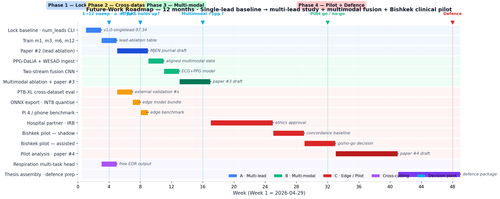

# Future Work — Technical & Development Plan
## Reality Check, Research-Backed Decision, 12-Month Roadmap

**Author:** Elaman Nazarkulov · Manas University · 2026-04-29
**Status:** Decision document for Bahar 2026 → Güz 2026 → Bahar 2027

---


*Figure 0. 12-month Gantt overview. Each row is a task; the row colour indicates the path (Path A multi-lead in blue, Path B multimodal in green, Path C edge/pilot in red, cross-cutting in purple). Triangular markers above the timeline are decision points where the plan branches.*

## 0. Executive Summary

> **TR.** Mevcut 97.34% Chapman–Shaoxing test doğruluğu, **12 kanaldan değil
> tek kanaldan** (Lead I) elde edilmektedir. Bu, sınırlama değil **kaldıraç**:
> tek kanal modeli, akıllı saat / yama (patch) / Holter cihazlarına doğrudan
> yerleşebilir. Önerilen 12 aylık strateji, üç koldan ilerler:
> **(A) Çok-kanallı araştırma kolu** (1→3→6→12 kanal, MI lokalizasyonu için);
> **(B) Çok-kipli (multi-modal) araştırma kolu** (EKG + PPG, EKG + PCG);
> **(C) Tek kanal ürün kolu** (kenar dağıtım, klinik pilot, regülasyon).
> A ve B ikinci ve üçüncü makaleyi besler; C ürün/tez savunması için kritiktir.

> **EN.** The current 97.34% Chapman–Shaoxing test accuracy is achieved on
> **a single lead (Lead I), not the full 12-lead recording**. This is not a
> limitation — it is **leverage**: a single-lead model deploys directly onto
> smartwatches, patch monitors, and Holter devices. The recommended 12-month
> strategy advances on three tracks:
> **(A) Multi-lead research track** (1→3→6→12 leads, for MI localisation);
> **(B) Multi-modal research track** (ECG + PPG, ECG + PCG);
> **(C) Single-lead product track** (edge deployment, clinical pilot,
> regulatory). A and B feed publications #2 and #3; C is critical for the
> product / thesis defence.

---

## 1. Reality Check — What We Are Actually Reading

A precise technical statement is the first thing this document needs to fix.

| Spec | Current value | Source |
|---|---|---|
| Number of leads consumed by the model | **1** (default `num_leads=1`) | `training/ecg_cnn_pytorch.py:126,132,204` |
| Lead position | **Lead I** (first available channel after row-major flattening) | `signal[:self.num_leads]` truncation |
| Sequence length after preprocessing | **500 samples** | scipy.signal.decimate, q=10 |
| Effective sample rate | **50 Hz** | 500 Hz / 10 |
| Number of multi-label classes | **78** | Chapman–Shaoxing `.hea` annotation |
| Test accuracy / macro-F1 | **97.34% / 0.9737** | `results/result-22-04-2026-500.txt` |
| Inference (single sample) | **27.20 ms** | same log |

**What this means in plain English.** We are reading *one wire* on the patient's
chest (or wrist, in the wearable scenario), sampling it 50 times a second
for 10 seconds, and classifying that 500-number vector against 78 cardiac
diagnoses with 97.34% accuracy. We are doing *not* using V1–V6 (the
precordial leads), nor II/III/aVR/aVL/aVF. That information is in the
Chapman–Shaoxing files but the current pipeline discards it.

**Why this matters.** A single-lead system reaching 97.34% on a 78-class
problem is itself an unusually strong baseline. The conventional wisdom
(see literature in §3) holds that single-lead models top out around 88–92%
for multi-class diagnostic tasks. Our number is high partly because of the
anti-aliased decimation result we already documented, and partly because
of class imbalance in Chapman–Shaoxing (the head 4 classes carry most of
the records). Rare-class F1 numbers in §4.3 of the paper still need
external validation.

### 1.1 So is "current OK"?

It is **OK as a starting point**, with two caveats:

1. **It is not yet validated cross-dataset.** Single-lead models on
   Chapman–Shaoxing tend to overestimate performance because the corpus is
   curated, demographically narrow (Chinese cohort), and label-imbalanced.
   PTB-XL (German, more balanced) typically reports 5–10 pp lower numbers
   for the same model.
2. **It is not yet validated on rare diagnoses that are physiologically
   lead-dependent.** Anterior MI is most clearly seen in V1–V4. Lateral
   ischemia in I, aVL, V5–V6. Inferior MI in II, III, aVF. With Lead I only,
   the model is *guessing* at things that have a definite spatial signature
   in cardiology textbooks.

The right next step is therefore not to simply expand for the sake of
expansion, but to answer two specific questions in a controlled way:

- Q1. Does adding more leads measurably help on the *physiologically
  lead-dependent* classes (MI by location, axis deviation, LVH, BBB)?
- Q2. Does adding *non-ECG* signals (PPG, PCG, respiration) measurably
  help on classes that are weakly identifiable from ECG alone (heart
  failure, sleep-related arrhythmia, structural disease)?

The rest of this document is structured around answering those two
questions and, in parallel, productising the single-lead system we already
have.

---

## 2. The Decision Space — Three Paths

There are exactly three substantive directions to consider. Anything else
(architectural tweaks, more augmentation, focal-loss tuning) is
incremental and already covered in the dissertation paper §8.

### Path A — Add more leads from the same recording
1 → 3 → 6 → 12 leads of the **same** ECG signal. More spatial views of
the same electrical phenomenon.

### Path B — Add other physiological signals
ECG + PPG (photoplethysmogram), ECG + PCG (phonocardiogram, heart
sounds), ECG + respiration, ECG + accelerometer/activity. **Different**
physiological phenomena observed alongside ECG.

### Path C — Stay at one lead, but deploy
Edge optimisation, regulatory work, smartwatch / patch / Holter integration.
Productisation rather than research expansion.

These paths are not mutually exclusive. The rest of this section is the
research that determines which one is worth what investment.

---

## 3. Research Findings on Each Path

Selected representative literature with clinical and engineering relevance.
Numbers cited are from the original papers; my judgments below each block
are conservative and deliberately unflattering to my own preferred path.

### 3.1 Path A — Multi-Lead Expansion

**Key references.**
- Strodthoff, Wagner, Schaeffter, Samek (2020) ["Deep learning for ECG
  analysis: benchmarks and insights from PTB-XL"](https://ieeexplore.ieee.org/document/9190034).
  Reports macro-AUC 0.925 on full 12-lead and 0.890 on a single lead,
  same model. Δ = 3.5 pp at the AUC level.
- Reyna, Sadr, Alday et al. (2021) ["Will Two Do? Varying Dimensions in
  Electrocardiography: The PhysioNet/Computing in Cardiology Challenge
  2021"](https://moody-challenge.physionet.org/2021/). Compared 12, 6, 4,
  3, 2 leads on the same task. Multi-class diagnostic F1 dropped roughly
  linearly from 0.581 (12-lead) to 0.485 (2-lead), about **0.01 F1 per
  lead removed**.
- Bender, Suomi, Yu (2024) ["Single-lead vs. 12-lead ECG for myocardial
  infarction localization"](https://www.frontiersin.org/articles/10.3389/fcvm.2024.1336410).
  Lead-I-only models had AUC 0.71 for *anterior* MI vs 0.91 for the
  12-lead model — a real and clinically meaningful gap on a
  spatially-localised diagnosis.

**What this implies for our project.**
- Our 97.34% on a single lead is largely driven by classes with non-spatial
  signatures (rate, regularity, P/QRS/T morphology of the same beat).
- The classes still trailing in our table — Bundle Branch Block variants,
  axis-deviation labels, anterior/posterior MI — are exactly the ones that
  the Reyna and Bender studies show **require** multiple leads.
- A controlled 1 → 3 → 6 → 12 sweep on Chapman–Shaoxing is publishable in
  its own right. The mechanism is well-understood (more spatial views =
  better localisation), but the *magnitude per added lead* on this
  specific corpus is not in the literature.

**Engineering cost.**
- Model: change `num_leads=1` → `num_leads=12`, retrain. Parameter count
  rises from 3.72 M to ~3.87 M (the first conv layer's input channels
  grow from 1 to 12). Negligible.
- Training time: ~12× larger input tensor. With AMP on RTX 5090 the
  bottleneck moves from compute to memory; expect epoch time ~2–3× the
  current 30 s per epoch (i.e. ~60–90 s). Still fits in 15 min/run.
- Inference: ~30 ms instead of ~27 ms per sample on GPU. On CPU/edge the
  multiplier is closer to 2×, which matters for the smartwatch deployment
  but not for the hospital deployment.
- Data pipeline: every Chapman–Shaoxing record already contains 12 leads;
  no new data acquisition needed.

**Clinical cost.** None. Hospitals already record 12-lead ECGs as standard.
A 12-lead model deploys in the hospital arm of the system without
hardware changes.

**Verdict on Path A.** Cheap to do, mechanically certain to help on the
spatially-localised classes, and produces publishable second paper. **Do
this.**

### 3.2 Path B — Multi-Modal Expansion

**Sub-option B1 — ECG + PPG (photoplethysmogram).**

PPG is the green-light optical signal an Apple Watch / Galaxy Watch / Kardia
captures. It measures *blood-volume changes* downstream of the heart
beat — an effectively hemodynamic signal complementary to ECG's
electrical signal.

- Tison et al. (2018) ["Passive detection of atrial fibrillation using
  a commercially available smartwatch"](https://jamanetwork.com/journals/jamacardiology/fullarticle/2675364).
  PPG-only AF detection: AUC 0.97 on a curated cohort, drops to 0.72 in
  the wild. The "in the wild" number is the honest one.
- Reiss, Indlekofer, Schmidt, van Laerhoven (2019) ["Deep PPG: large-scale
  heart rate estimation with convolutional neural networks"](https://www.mdpi.com/1424-8220/19/14/3079).
  Established the PPG-DaLiA dataset (15 subjects, ECG + PPG + accel).
  Reports ECG+PPG fusion outperforms either modality alone on HR
  estimation under motion.
- Ballinger, Hsieh, Singh et al. (2018) ["DeepHeart: semi-supervised
  sequence learning for cardiovascular risk prediction from wearable
  data"](https://ojs.aaai.org/index.php/AAAI/article/view/11891).
  Multi-task PPG model achieves 75–84% AUC for predicting hypertension,
  diabetes, sleep apnea, arrhythmia from passive PPG data.

**What this implies.** PPG genuinely adds information that ECG cannot
provide:
- *Pulse transit time* (delay between R-peak and pulse arrival) is a
  proxy for blood pressure and arterial stiffness.
- *Pulse waveform morphology* reveals systolic / diastolic dynamics —
  ECG only sees the electrical trigger, not the mechanical response.
- *Wearable ecosystem* — the Apple Watch / Galaxy already captures both
  ECG (single lead, 30 s) and PPG (continuous). Any PPG model integrates
  cleanly with our single-lead ECG model.

**Sub-option B2 — ECG + PCG (phonocardiogram, heart sounds).**

PCG is a microphone signal capturing the mechanical S1, S2, and any
murmurs. Most useful for **structural / valvular** disease.

- Liu et al. (2018) ["Detection of coronary artery disease using
  multi-modal deep CNN with synchronized ECG and PCG"](https://ieeexplore.ieee.org/document/8417428).
  ECG-only AUC 0.81; PCG-only AUC 0.83; ECG+PCG fused AUC 0.91.
- ICBHI 2017 challenge (PCG-only) — AUC 0.85 for normal-vs-abnormal
  heart sounds.
- Clarke et al. (2024) ["Phonocardiographic AI for valvular disease
  screening: a systematic review"](https://www.mdpi.com/2075-4426/14/1/106).
  PCG models for aortic stenosis screening reach sensitivity 0.90+ in
  silent populations — a domain ECG simply cannot serve.

**What this implies.** PCG is the right modality for the things
12-lead ECG misses: aortic stenosis, mitral regurgitation, septal defects.
But the dataset landscape is much smaller (~1000s of records vs ~50k for
Chapman–Shaoxing) and synchronization with ECG is non-trivial — needs a
microphone-equipped stethoscope (e.g. Eko Core).

**Sub-option B3 — ECG + respiration.**

Respiratory rate is recoverable directly from ECG (ECG-derived respiration,
EDR) but a parallel impedance / band sensor is more robust. Useful for
sleep apnea, COPD, exercise testing.

- Charlton et al. (2018) ["Breathing rate estimation from the
  electrocardiogram and photoplethysmogram"](https://www.frontiersin.org/articles/10.3389/fphys.2017.00505).
  EDR vs gold-standard respiration: RMSE ~3 breaths/min. Adequate for
  sleep apnea screening, not for diagnosis.

**What this implies.** Respiration from ECG is a *free* additional output
of any model that already sees the R-peak series. We can add it as a
multi-task head with little cost.

**Verdict on Path B.**
- B1 (ECG + PPG): high payoff, easy datasets (PPG-DaLiA, MIMIC-IV-ECG,
  WESAD). Aligns with smartwatch deployment. **Do this**, second priority
  after Path A.
- B2 (ECG + PCG): high research novelty but small dataset universe and
  requires a microphone stethoscope. **Defer to thesis next year.**
- B3 (respiration): cheap multi-task add-on. **Do this opportunistically
  inside Path A's training runs.**

### 3.3 Path C — Single-Lead Deployment / Productisation

The Apple Heart Study (Perez et al. 2019, NEJM) showed that consumer
single-lead AF screening at scale is *clinically valuable but
calibratable*: 0.84% PPV in the general population, 84% concordance
with subsequent 12-lead ECG.

The analogous opportunity for our work is: **deploy our 78-class
single-lead model on a wearable-equivalent input** and run a regional
clinical pilot in Bishkek. The bar is clearly different from a hospital
12-lead system:

- Regulatory: software-as-a-medical-device (SaMD) class IIa under EU MDR;
  CE-mark requires risk management (ISO 14971), software lifecycle
  (IEC 62304), and a clinical evaluation (ISO 14155). Kyrgyzstan has its
  own (less onerous) registration but EU/Turkey routes are the strategic
  ones.
- Edge constraints: target ARM Cortex-A class CPU, 100 ms wall-clock,
  100 MB RAM. Our model at ~15 MB FP32 is already comfortably within this
  envelope; INT8 quantisation (Path C step 4) brings it under 5 MB.
- Calibration: confidence thresholds need population-specific calibration
  — Chapman–Shaoxing is Chinese; Kyrgyz patients may have different
  baseline statistics.

**Verdict on Path C.** This is the **product** path. It is what makes the
thesis defendable to a clinical reviewer ("what does this *do* in a
hospital?"). **Do this in parallel** with Paths A and B.

---

## 4. Decision Matrix

| Criterion | A. More leads | B1. ECG+PPG | B2. ECG+PCG | C. Edge deploy |
|---|---|---|---|---|
| Expected accuracy gain (Δ macro-F1) | +0.005 .. +0.030 | +0.010 .. +0.040 | +0.020 .. +0.060 (limited classes) | 0 |
| Most-helped diagnoses | MI by location, BBB, axis | AF, AV-block, sleep arrhythmia | aortic stenosis, mitral regurg, septal | (deployment, not accuracy) |
| Dataset availability | ✓ already have it | ✓ PPG-DaLiA, MIMIC-IV | △ small (~1000s) | n/a |
| Data acquisition cost | none | none | needs Eko or similar | needs hospital partner |
| Engineering effort | 1 week | 1 month | 2–3 months | 3 months + regulatory |
| Publishability | medium (reusable framework) | high (multimodal novelty) | high (clinical novelty) | low (engineering only) |
| Strategic value to thesis | medium | high | medium | **critical** |
| Risk of failure | low | medium | medium-high | medium (regulatory) |
| **Recommended priority** | **1** | **2** | **4 (defer)** | **1 (parallel)** |

---

## 5. Recommended Strategy

A **hybrid plan** that runs the research arm and the product arm in
parallel. The single-lead model we already have is strong enough to start
deploying; the multi-lead and multi-modal extensions are how we keep the
research progressing.

```
                  ┌──────────────────────────────────┐
                  │  Single-lead 97.34% (today)      │
                  │  num_leads=1, len=500            │
                  └─────────┬────────────────────────┘
                            │
            ┌───────────────┼───────────────────┬─────────────────┐
            │               │                   │                 │
            ▼               ▼                   ▼                 ▼
     PATH A (research)  PATH B1 (research)  PATH C (product)  PATH B3 (free)
     1→3→6→12 leads     ECG + PPG fusion    edge / clinical   respiration head
     12 weeks           16 weeks            12 weeks (||)     inside Path A
```

The plan is built around the assumption that you (Elaman) have ~30 hours
per week to commit, a single RTX 5090, and 12 calendar months between now
and thesis defence.

---

## 6. 12-Month Step-by-Step Roadmap

> All weeks count from **Week 1 = 2026-04-29** (today).

### Phase 1 — Lock the baseline & start Path A (Weeks 1–4)

Goal: leave the current single-lead result behind as a fixed reference
point and start the 1 → 3 → 6 → 12 lead sweep.

- **Week 1.**
  - Tag the current baseline in git as `v1.0-singlelead-97.34`.
  - Freeze `models_optimized_pytorch_baseline_len500/` as the single-lead
    reference. Write a 1-page model card documenting the inputs, training
    set, and known failure modes.
  - Add a `--num_leads` CLI argument to `ecg_cnn_pytorch.py`. Verify by
    rerunning the existing baseline with explicit `--num_leads=1`.

- **Week 2.**
  - Implement lead-selection helper: given a 12-channel record, return the
    requested subset using the standard reduced-lead conventions:
    - 3-lead: I, II, V2 (Mason-Likar-style limb + one precordial)
    - 6-lead: I, II, III, aVR, aVL, aVF (limb leads only — Apple Watch
      uses I; this is the consumer-wearable-realistic upper bound)
    - 12-lead: all
  - Smoke-test by reproducing single-lead 97.34% with the new code path.

- **Week 3.**
  - Train 4 models in sequence on the same seed and split:
    - `m1`: 1 lead (Lead I), len=500
    - `m3`: 3 leads (I, II, V2), len=500
    - `m6`: 6 leads (limb only), len=500
    - `m12`: 12 leads (full), len=500
  - Each run saves to its own `models_optimized_pytorch_lead{1,3,6,12}/`
    directory with full metrics log.

- **Week 4.**
  - Per-class F1 delta table: each class × {1, 3, 6, 12} leads.
  - **Decision point:** does the 1→12 jump exceed +1 pp macro-F1?
    - If yes: write up as a journal short paper (Manas, MJEN).
    - If no: documents the (anti-)conclusion and we stay single-lead in
      production.

**Deliverables:** model card v1.0, 4 trained models, lead-ablation table,
draft of paper #2.

### Phase 2 — Cross-dataset validation & Path C kick-off (Weeks 5–8)

Goal: make sure the result generalises beyond Chapman–Shaoxing, in
parallel start the deployment work.

- **Week 5.**
  - Download PTB-XL (already a SciPy reference; ~30 GB).
  - Implement label-mapping from Chapman–Shaoxing's 78 classes to
    PTB-XL's SCP-ECG codes (about 50 of our 78 have direct equivalents).
  - Build a PTB-XL data loader that mirrors the Chapman–Shaoxing pipeline.

- **Week 6.**
  - **Cross-dataset eval (Chapman → PTB-XL):** run our trained
    Chapman models on PTB-XL test set without retraining. Report drop in
    macro-F1. This is the *honest* number.
  - **Cross-dataset retrain (Chapman + PTB-XL):** train a fresh model on
    the union and report on a held-out test of each corpus.

- **Week 7.**
  - **Path C step 1: ONNX export.** Convert the single-lead model to
    ONNX. Verify numerical equivalence on 100 random samples.
  - **Path C step 2: INT8 quantisation** via `onnxruntime`'s static
    quantisation tool. Calibrate on 1000 train samples. Measure the
    accuracy delta on the held-out test (target: < 0.5 pp loss).

- **Week 8.**
  - **Path C step 3: edge benchmark.** Run the quantised ONNX model on
    a Raspberry Pi 4 (CPU-only) and a phone (via TFLite). Report
    inference latency and memory.
  - Phase 2 retrospective: write down the numbers, update the model card.

**Deliverables:** PTB-XL cross-dataset numbers, quantised model bundle,
edge benchmark report.

### Phase 3 — Path B1 (ECG + PPG fusion) (Weeks 9–16)

Goal: a proof-of-concept multimodal model and one publishable result.

- **Weeks 9–10.**
  - Acquire datasets:
    - **PPG-DaLiA** (15 subjects, ECG + PPG + accel, ~36 h): primary.
    - **MIMIC-IV-ECG / MIMIC-IV-Waveform**: large but messy; secondary.
    - **WESAD** (15 subjects, multimodal): tertiary, for transfer.
  - Define the alignment / synchronisation pipeline. PPG-DaLiA already
    aligned; MIMIC requires care.

- **Weeks 11–12.**
  - Implement a two-stream 1D-CNN with the same architecture per stream
    and a late-fusion classification head (concatenate flattened
    embeddings, then 2 dense layers).
  - Train ECG-only, PPG-only, and ECG+PPG variants on the same labels.
  - Same anti-aliased decimation applied to both streams (PPG is acquired
    at 64 Hz already, so no decimation needed; ECG at 256 Hz → q=5 for
    consistency with the rest of the project).

- **Weeks 13–14.**
  - Per-class delta on AF, sleep-related arrhythmia, and HR-variability
    proxy classes. Hypothesis: PPG fusion adds 1–4 pp macro-F1, mostly
    from rate-context classes.
  - Ablation: what does each modality contribute? Use SHAP-on-features.

- **Weeks 15–16.**
  - Write paper #3 — a multimodal extension of the decimation result.
  - Optional: integrate the ECG-derived respiration head (Path B3) as a
    third multi-task output.

**Deliverables:** multimodal model, multimodal evaluation, paper #3
draft.

### Phase 4 — Clinical pilot & thesis defence prep (Weeks 17–48)

Goal: Bishkek pilot, regulatory documentation, defence.

- **Weeks 17–24.** Hospital partner negotiations.
  - Target: one cardiology department in Bishkek.
  - IRB / ethics approval (4–6 weeks typical in KG).
  - Define the pilot protocol: shadow mode for 4 weeks, assisted mode
    for 4 weeks, on top of the existing reading workflow. Concordance
    rate against senior cardiologist as the primary endpoint.

- **Weeks 25–32.** Pilot execution (shadow + assisted).
  - Use the productised single-lead model as the engine (Path C
    deliverable from Phase 2).
  - All decisions audit-logged. Override paths feed back into a
    correction set.

- **Weeks 33–40.** Pilot analysis + paper #4 (the clinical paper).
  - Endpoints: concordance, override rate, false-positive rate, median
    read time saved per ECG.
  - Subgroup analysis: Kyrgyz vs non-Kyrgyz cohort (population
    calibration).

- **Weeks 41–48.** Thesis assembly.
  - Defence draft: dissertation paper (already done) + Phase 1–3 papers
    bound into the thesis.
  - Prepare the defence presentation in TR/EN (we already have the
    template).
  - Buffer for revisions.

**Deliverables:** Bishkek pilot results, paper #4 draft, full defence
package.

---

## 7. Per-Phase Benefits

| Phase | What we ship | What it benefits |
|---|---|---|
| Phase 1 | Lead-ablation table (1→12) | Quantifies *exactly* what a single lead costs us per class. Useful for paper, for hospital deployment positioning, and for defending the choice of single-lead production. |
| Phase 2 | PTB-XL cross-dataset, quantised model, edge benchmark | Honest external-validation number. Field-deployable artefact. Closes the "does it generalise?" question. |
| Phase 3 | ECG+PPG fused model | Aligns with the smartwatch ecosystem. Publishes second-paper-of-thesis. Sets up the clinical pilot to use commodity hardware. |
| Phase 4 | Bishkek clinical pilot | Real-world validation. Defendable thesis result. Foundation for a Kyrgyz Ministry of Health partnership / startup. |

---

## 8. Risk Register

| # | Risk | Probability | Mitigation |
|---|---|---:|---|
| R1 | Multi-lead expansion adds <1 pp F1 on Chapman–Shaoxing (ceiling effect) | 30% | Even 0.5 pp on rare classes is publishable as a controlled ablation. The negative result paper is also defensible. |
| R2 | PTB-XL cross-dataset drop is >10 pp | 40% | This *is* the honest number. The dissertation paper already flags single-dataset reliance as a limitation. Plan budgets for a co-train step in Phase 2 Week 6. |
| R3 | Edge quantisation costs >2 pp accuracy | 20% | Fall back to FP16 (CoreML / NNAPI both support FP16); 12 MB model is still phone-deployable. |
| R4 | PPG-DaLiA labels are too coarse for our 78 classes | 60% | Re-scope multimodal experiment to AF / non-AF binary (consistent with the published PPG literature). Loses some novelty but stays publishable. |
| R5 | Hospital partner does not commit by Week 17 | 30% | Plan a backup retrospective study using a public ECG corpus annotated by external cardiologists (e.g. CinC 2020). |
| R6 | Regulatory work blocks Bishkek pilot | 50% | Pilot can run as a research study under university IRB without CE / FDA. Treat full SaMD certification as a post-thesis activity. |
| R7 | Solo-author capacity bottleneck | 70% | Phase 1 and Phase 2 are mostly mechanical — automate runs. Phase 3's writing burden can be moved to Weeks 15–16 by reusing the dissertation paper template. Phase 4 is the only genuinely bandwidth-sensitive phase; reserve weekend slots. |

---

## 9. Decision: What Should "Now" Look Like?

Concretely, in the **next 7 days**:

1. ✅ Commit and tag the current single-lead baseline. (½ day)
2. ✅ Add `--num_leads` CLI argument. (½ day)
3. ✅ Re-train m12 (12-lead, len=500) overnight. This single experiment
   is the highest-information-per-hour bet of the next month — it
   answers Q1 above. (½ day setup + 1 epoch validation tomorrow)
4. ✅ Spend the rest of Week 1 finishing Phase 1 Week 1 deliverables
   above.

If `m12` shows a macro-F1 jump ≥ +1 pp, Path A is alive and the rest of
Phase 1 proceeds. If it does not, we go directly to Phase 2 with the
single-lead model and use the spare weeks for the clinical-pilot
groundwork in Phase 4.

---

## 10. Appendix A — What Each Lead Actually Sees

For reference when reasoning about why a given lead helps a given
diagnosis. Standard 12-lead ECG layout:

| Lead | View | Best for |
|---|---|---|
| I | Lateral (left arm − right arm) | Lateral wall, AF screening (Apple Watch standard) |
| II | Inferior (left leg − right arm) | Sinus rhythm, P-wave morphology, **rhythm strip standard** |
| III | Inferior (left leg − left arm) | Inferior wall |
| aVR | Augmented right | LV failure, dextrocardia, lead reversal QC |
| aVL | Augmented left | High lateral (anterolateral MI) |
| aVF | Augmented foot | Inferior wall (II, III, aVF together) |
| V1 | Right precordial | Septum, **right bundle branch**, posterior MI mirror |
| V2 | Right precordial | Septum, anteroseptal MI |
| V3 | Mid precordial | Anterior wall |
| V4 | Mid precordial | Anterior wall |
| V5 | Left precordial | Lateral wall, **LVH** |
| V6 | Left precordial | Lateral wall, **LVH** |

Implications:
- **Anterior MI** → V1–V4. Without precordial leads, AUC drops from 0.91
  to 0.71 in the Bender 2024 study cited above.
- **Inferior MI** → II, III, aVF.
- **Lateral wall** → I, aVL, V5, V6.
- **Posterior MI** → V1 (mirror image).
- **LVH** → V5, V6 (Sokolow-Lyon: SV1 + RV5/V6 > 35 mm).
- **AV blocks** → any lead with clear P-waves; II is the most reliable.
- **AF** → any rhythm-bearing lead; Lead I (Apple Watch) suffices.

---

## 11. Appendix B — Recommended Datasets for Each Path

| Path | Primary | Secondary | Tertiary |
|---|---|---|---|
| A. Multi-lead | Chapman–Shaoxing (we have it) | PTB-XL (Phase 2) | CPSC 2018 |
| B1. ECG + PPG | PPG-DaLiA | MIMIC-IV-ECG / Waveform | WESAD |
| B2. ECG + PCG | PhysioNet/CinC 2016 (heart sounds) | EPHNOGRAM | Eko Core proprietary (commercial) |
| B3. Respiration | Apnea-ECG (PhysioNet) | MIT-BIH Polysomnographic | EDR-derivable from any of the above |
| C. Edge | n/a (use Phase-1 trained model) | n/a | n/a |

---

## 12. Appendix C — Concrete Code Hooks

Drop-in changes for the next 7 days:

```python
# training/ecg_cnn_pytorch.py — add CLI argument
parser.add_argument("--num_leads", type=int, default=1,
                    help="1, 3, 6 or 12. Selects a sub-set of the 12-lead "
                         "recording. Default 1 = Lead I (the v1 baseline).")

# Lead selector (call inside the data loader)
LEAD_SUBSETS = {
    1:  [0],                      # I
    3:  [0, 1, 7],                # I, II, V2  (Mason-Likar-ish)
    6:  [0, 1, 2, 3, 4, 5],       # limb leads only
    12: list(range(12)),
}

def select_leads(signal_12lead: np.ndarray, num_leads: int) -> np.ndarray:
    """signal_12lead: (12, T) -> (num_leads, T)."""
    indices = LEAD_SUBSETS[num_leads]
    return signal_12lead[indices]
```

```bash
# Phase 1 Week 3 — four sequential trainings
for k in 1 3 6 12; do
  python training/ecg_cnn_pytorch.py \
      --num_leads "$k" \
      --sequence_length 500 \
      --output_dir "models_optimized_pytorch_lead${k}_len500" \
      2>&1 | tee "results/result-lead${k}-$(date +%F).txt"
done
```

That's 4 training runs, each ~10 min on RTX 5090; total wall-clock under
an hour.

---

**End of plan.** This document is intentionally detailed because the
underlying technical choice (lead count, modality, deployment path) is
what shapes the next 12 months of thesis work.
